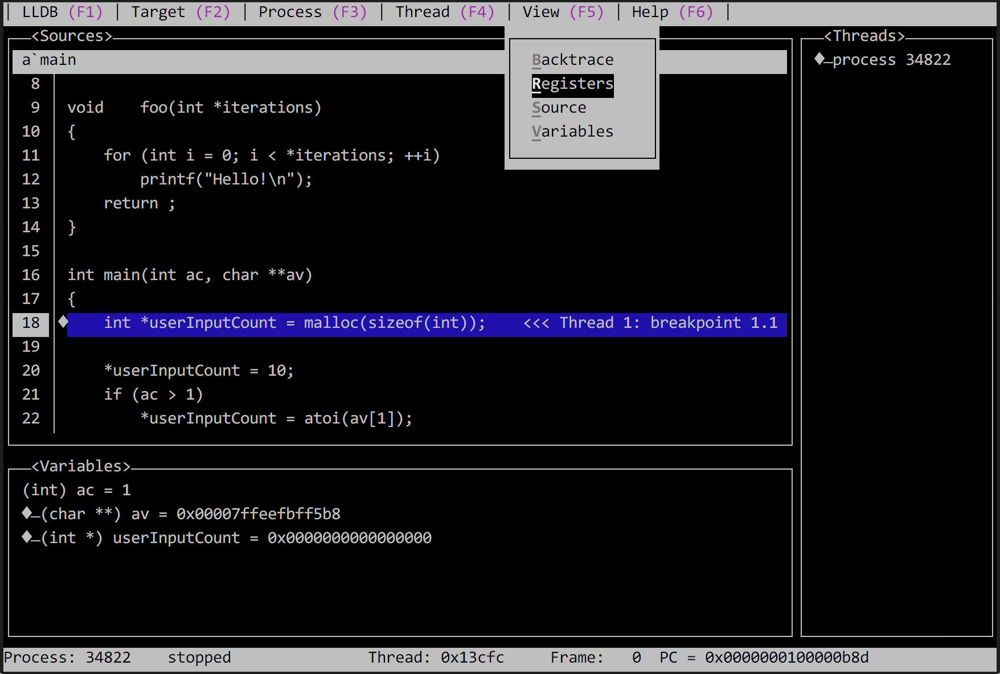

<!-- ﷽ , In the name of God, the All-Merciful, the All-Compassionate. -->

<!-- >Metadata -----------------------------------------------------------------

	AUTHOR(S)
		akharrou

	CONTACT
		idev.aymen@gmail.com

	MOTIVATION(S)
		Promote LLDB, because it is an amazing tool that can benefit in debugging. Explain/remind what LLDB is and how to use it.

	DESCRIPTION
		[Beginner to Intermediate Level] Tutorial on LLDB.


<!-- >Top Matter -------------------------------------------------------------->

QuickDocs \| Low Level Debugger (LLDB)
===

> ***January 2020***

---

<!-- Table of >Contents ------------------------------------------------------->

# Contents

- [1. Overview / Cheat Sheet](#1-overview--cheat-sheet)
- [2. What is it ?](#2-what-is-it-)
- [3. How do I use it ?](#3-how-do-i-use-it-)
	- [3.1. Compile Program](#31-compile-program)
		- [3.1.1. Debug Flags: `-g` &amp; `-O0`](#311-debug-flags--g---o0)
		- [3.1.2. Sanitizer Flags: `-fsanitize` family](#312-sanitizer-flags--fsanitize-family)
		- [3.1.3 Makfile Setup](#313-makfile-setup)
	- [3.2. Run LLDB](#32-run-lldb)
	- [3.3. Load LLDB](#33-load-lldb)
	- [3.4. Setup LLDB](#34-setup-lldb)
		- [3.4.1. Breakpoints](#341-breakpoints)
		- [3.4.2. Watchpoints](#342-watchpoints)
	- [3.5. Start Debugging](#35-start-debugging)
		- [3.5.1. Launch](#351-launch)
		- [3.5.2. Attach](#352-attach)
	- [3.6. Graphical User Interface (`GUI`)](#36-graphical-user-interface-gui)
		- [3.6.1 About](#about)
		- [3.6.2 Usage Commands *[Help Menus]*](#usage-commands)
	- [3.7. Control Process Execution](#37-control-process-execution)
	- [3.8. Examine](#38-examine)
		- [3.8.1. Source code](#381-source-code)
		- [3.8.2. Threads](#382-threads)
		- [3.8.3. Stack Frames](#383-stack-frames)
		- [3.8.4. Variables](#384-variables)
		- [3.8.5. Registers](#385-registers)                               <!-- w/ `register` -->
		- [3.8.6. Expressions](#386-expressions)                           <!-- w/ `expression` -->
		- [3.8.7. Memory *(Advanced)*](#387-memory)                                     <!-- w/ `memory` -->
		- [3.8.8. Instructions *(Advanced)*](#388-assembly-instructions)   <!-- w/ `disassemble` -->
	- [3.9. Self-Help: `help` & `apropos` commands](#)
- [4. Beyond Basics *(Advanced)*](#3-how-do-i-use-it-)
	- [4.1. `LLDB` Settings](#38-examine)
	- [4.2. `LLDB` Commands](#38-examine)
	- [4.3. `LLDB` Logging](#38-examine)
	- [4.4. `LLDB` Bugreporting](#38-examine)

<!--
- [3.8.7. Memory](#387-memory)
  	- [`find`](#)    -- Find a value in the memory of the current target process.
  	- [`history`](#) -- Print recorded stack traces for allocation/deallocation events associated with an address.
  	- [`read`](#)    -- Read from the memory of the current target process.
  	- [`region`](#)  -- Get information on the memory region containing an address in the current target process.
  	- [`write`](#)   -- Write to the memory of the current target process.

  - [`settings`](#)
  	- [`append`](#)  -- Append one or more values to a debugger array, dictionary, or string setting.
  	- [`clear`](#)   -- Clear a debugger setting array, dictionary, or string.
  	- [`insert-after`](#) -- Insert one or more values into a debugger array settings after the specified element index.
  	- [`insert-before`](#) -- Insert one or more values into an debugger array setting immediately before the specified element
                       index.
  	- [`list`](#)    -- List and describe matching debugger settings. Defaults to all listing all settings.
  	- [`remove`](#)  -- Remove a value from a setting, specified by array index or dictionary key.
  	- [`replace`](#) -- Replace the debugger setting value specified by array index or dictionary key.
  	- [`set`](#)     -- Set the value of the specified debugger setting.
  	- [`show`](#)    -- Show matching debugger settings and their current values. Defaults to showing all settings.

  - [`command`](#)
  	- [`alias  `](#) -- Define a custom command in terms of an existing command.  Expects 'raw' input (see 'help raw-input'.)
  	- [`delete `](#) -- Delete one or more custom commands defined by 'command regex'.
  	- [`history`](#) -- Dump the history of commands in this session.
  	- [`regex  `](#) -- Define a custom command in terms of existing commands by matching regular expressions.
  	- [`script `](#) -- Commands for managing custom commands implemented by interpreter scripts.
  	- [`source `](#) -- Read and execute LLDB commands from the file <filename>.
  	- [`unalias`](#) -- Delete one or more custom commands defined by 'command alias'.

  - [`log`](#)
  	- [`disable`](#) -- Disable one or more log channel categories.
  	- [`enable`](#)  -- Enable logging for a single log channel.
  	- [`list`](#)    -- List the log categories for one or more log channels.  If none specified, lists them all.
  	- [`timers`](#)  -- Enable, disable, dump, and reset LLDB internal performance timers.

  - [`script`](#)
  - [`bugreport`](#)
 -->


<!-- >Start --------------------------------------------------------------------
.
.
.
-->


---
[🏠](#contents) | [⬅️](#contents) | [➡️](#2-what-is-it-)
# 1. Overview / Cheat Sheet
<small>`[Search Tags: >overview >cheatsheet >brief >review >revision >reminder >quickreminder >viewover >fastreview >quickreview]`</small>
<br>
<br>


[🏠](#contents) | [⬅️](#PREVIOUS) | [➡️](#NEXT)
## 1.1. Beginner Usage Overview
<small>`[Search Tags: >]`</small>
<br>
<br>


> TODO: ## 1.1. Beginner Usage Overview

Lorem ipsum dolor sit amet, consectetur adipiscing elit, sed do eiusmod tempor incididunt ut labore et dolore magna aliqua. Quisque id diam vel quam elementum pulvinar. Orci nulla pellentesque dignissim enim. Magna fringilla urna porttitor rhoncus dolor purus. Mollis nunc sed id semper risus in hendrerit gravida rutrum. Faucibus turpis in eu mi bibendum. Ultrices neque ornare aenean euismod elementum. Consectetur lorem donec massa sapien faucibus. At imperdiet dui accumsan sit amet nulla facilisi morbi tempus. Rhoncus urna neque viverra justo nec ultrices dui. Sed faucibus turpis in eu mi bibendum.


<br>
<br>

> ***Further Reading:***
>
> | # | Type               | Author                 | Link
> | - | ------------------ | ---------------------- | --------------------------
> | 1 | n/a               | n/a                    | n/a


---
[🏠](#contents) | [⬅️](#PREVIOUS) | [➡️](#NEXT)
## 1.2. Intermediate Usage Overview
<small>`[Search Tags: >]`</small>
<br>
<br>


> TODO: ## 1.2. Intermediate Usage Overview

Lorem ipsum dolor sit amet, consectetur adipiscing elit, sed do eiusmod tempor incididunt ut labore et dolore magna aliqua. Quisque id diam vel quam elementum pulvinar. Orci nulla pellentesque dignissim enim. Magna fringilla urna porttitor rhoncus dolor purus. Mollis nunc sed id semper risus in hendrerit gravida rutrum. Faucibus turpis in eu mi bibendum. Ultrices neque ornare aenean euismod elementum. Consectetur lorem donec massa sapien faucibus. At imperdiet dui accumsan sit amet nulla facilisi morbi tempus. Rhoncus urna neque viverra justo nec ultrices dui. Sed faucibus turpis in eu mi bibendum.


<br>
<br>

> ***Further Reading:***
>
> | # | Type                  | Author                 | Link
> | - | --------------------- | ---------------------- | --------------------
> | 1 | Documentation Archive | Apple                  | [GDB and LLDB Command Examples](https://developer.apple.com/library/archive/documentation/IDEs/Conceptual/gdb_to_lldb_transition_guide/document/lldb-command-examples.html#//apple_ref/doc/uid/TP40012917-CH3-SW1)


---
[🏠](#contents) | [⬅️](#PREVIOUS) | [➡️](#NEXT)
## 1.3. Cheat Sheet
<small>`[Search Tags: >]`</small>
<br>
<br>


> TODO: ## 1.3. Cheat Sheet

Lorem ipsum dolor sit amet, consectetur adipiscing elit, sed do eiusmod tempor incididunt ut labore et dolore magna aliqua. Quisque id diam vel quam elementum pulvinar. Orci nulla pellentesque dignissim enim. Magna fringilla urna porttitor rhoncus dolor purus. Mollis nunc sed id semper risus in hendrerit gravida rutrum. Faucibus turpis in eu mi bibendum. Ultrices neque ornare aenean euismod elementum. Consectetur lorem donec massa sapien faucibus. At imperdiet dui accumsan sit amet nulla facilisi morbi tempus. Rhoncus urna neque viverra justo nec ultrices dui. Sed faucibus turpis in eu mi bibendum.


<br>
<br>

> ***Further Reading:***
>
> | # | Type               | Author                 | Link
> | - | ------------------ | ---------------------- | --------------------------
> | 1 | PDF                | nesono                 | [`lldb` Cheat Sheet](https://www.nesono.com/sites/default/files/lldb%20cheat%20sheet.pdf)


---
[🏠](#contents) | [⬅️](#contents) | [➡️](#3-how-do-i-use-it-)
# 2. What is it ?
<small>`[Search Tags: >lldb.what? >lldbwhat? >lldb.who? >lldb.why? >lldb.whocares? >lldb.whycare? >lldb.? >lldb? >wat >woot >wut >whatisit ?isit >whatsit >about >description >whycare >caring? >info >intro >lldb.whatisit >lldb.whycare? >lldb.whyshouldicare?]`</small>
<br>
<br>


#### What is it ?

-	LLDB, is a program – that provides an interface for you to examine the execution of a *[running]* program – instruction by instruction, or step by step, or breakpoint by breakpoint.

	> Didnt understand ? Try this:
	>
	> LLDB, short for ***Low-Level-De-Bugger***, is a program – **that provides an interface** *(a way/channel/portal/access-point/control-panel)* **for you to examine the execution** *([individual] actions/steps taken-by/performed-by)* **of a** *[-nother]* **program** – *[CPU]* **instruction by instruction, or** *[source code]* **statement by statement, or breakpoint** *(checkpoint(s) set by you, in the source code)* **by breakpoint.** <br>

- "`lldb` is the default debugger in Xcode on macOS and supports debugging C, Objective-C and C++ on the desktop and iOS devices and simulator."

#### Why should I care ?

-	*The short answer;* because it will save you *(***THOUSANDS*** of)* hours of [debugging](https://en.wikipedia.org/wiki/Debugging) [, and by extention, of your ***LIFE***].

	> What's "***Debugging***" ?
	>
	> Short, oversimplified answer; the process of locating [bugs](https://en.wikipedia.org/wiki/Software_bug) *[in source code]*, finding their cause(s) and [patching](https://en.wikipedia.org/wiki/Patch_(computing)) (i.e fixing/removing) them.


<br>
<br>

> ***Furthur Reading:***
>
> | # | Type               | Author                 | Link
> | - | ------------------ | ---------------------- | --------------------------
> | 1 | Documentation | LLDB | [The LLDB Debugger \| Official Website](https://lldb.llvm.org/)
> | 2 | Encyclopedia | Wikipedia | [LLDB (debugger)](https://en.wikipedia.org/wiki/LLDB_(debugger))


---


[🏠](#contents) | [⬅️](#2-what-is-it-) | [➡️](#31-compile-program)
# 3. How do I use it ?
<small>`[Search Tags: >lldb.usage > lldb.use >use >usage >how? >howtouse >usinglldb >howtouse >howdoiuseit >howtousage >lldbhowtouse >uselldb >lldbusage]`</small>
<br>
<br>

TODO : # 3. How do I use it ?

-	***To use LLDB***:

	```shell
	$> clang <source-code-files> -g -O0
	$> lldb <execuable>
	$> (lldb) b main
	$> (lldb) r <arg-1> <arg-2> ... <arg-n>
	$> (lldb) gui
	```

	---

	>	In words;
	>
	>	- *1.* **Compile Program** ([§3.1](#31-compile-program)) with **Debug Flags** ([§3.1.1 ](#311-debug-flags--g---o0))
	>	- *2.* **Launch LLDB** ([§3.2](#32-launch-lldb))
	>	- *3.* **Load LLDB** *[with your program]* ([§3.3](#33-load-lldb))
	>	- *4.* **Setup LLDB** ([§3.4](#34-setup-lldb)) (e.g. entry-point, breakpoints, watchpoints) *[for your program]*
	>	- *5.* **Run your program** ([§3.5](#35-start-or-attach-program)) *(within LLDB)*
	>	- *6.* **Launch Graphical User Interface** ([3.6](#36-graphical-user-interface-gui)) mode
	>	- *7.* **Examine the Execution** ([§3.7](#38-examine-execution)) *[of your program]*. <br> <br>
	>
	> *Annotated Command Line:*
	>
	> ```shell
	> $> # 1. Compile
	> $> clang <source-code> -g -O0
	> $>
	> $> # 2,3. Launch & Load
	> $> lldb <execuable>
	> $>
	> $> # 4. Setup
	> $> (lldb) b main  # Choose your entry-point, I chose the `int main()` function
	> $> (lldb) b ...   # Add more breakpoints if you want
	> $>
	> $> # 5. Run (optionally, with arguments)
	> $> (lldb) run <arg-1> <arg-2> ... <arg-n>
	> $>
	> $> # 6. Launch 'gui' mode
	> $> (lldb) gui
	> $>
	> $> # 7. Examine Code
	> ```

	> *<small>[**Note**:*
	>
	> -	*There is also a brief section on a set of *[compiler]* flags, which, basically, make up the other half of the [debugging](https://en.wikipedia.org/wiki/Debugging) tools/weapons available to you – ***the `"fsanitize"` family*** ([§3.1.2](#312-sanitizer-flags--fsanitize-family)) *[of flags]*. Don't miss it, you'll miss out on a LOT ! <br>*
	>
	> *- **end note**]</small>*


<br>
<br>

> ***Ressources:***
>
> | # | Type               | Author                 | Link
> | - | ------------------ | ---------------------- | --------------------------
> | 1 | Documentation | LLDB | [(Official) Tutorial](https://lldb.llvm.org/use/tutorial.html)
> | 2 | Documentation | Apple | [LLDB Quick Start Tutorial](https://developer.apple.com/library/archive/documentation/General/Conceptual/lldb-guide/chapters/Introduction.html#//apple_ref/doc/uid/TP40016717-CH1-DontLinkElementID_42)


---
[🏠](#contents) | [⬅️](#3-how-do-i-use-it-) | [➡️](#311-debug-flags--g---o0)
## 3.1. Compile Program
<small>`[Search Tags: >lldb.compileprogram >compileprogram >db.compileprogram >compilationstep >compilestep >compprogram]`</small>
<br>

Contents
---
- [1 Debug Flags: `-g` & `-O0`](#311-debug-flags--g---o0)
- [2 Sanitize Flags: `fsanitize` family](#312-sanitizer-flags--fsanitize-family)

---


-	***LLDB works by loading it with*** *(i.e setting it up to run)* ***an execuable*** *[file]*.

-	First thing would be to [compile](http://www.cs.ecu.edu/~karl/3300/spr16/Notes/System/compile.html) a program; and when debugging, don't forget to compile with the ***debugging*** ([§3.1.1](#311-debug-flags--g---o0)) and ***sanitizer*** ([3.1.2](#312-sanitizer-flags--fsanitize-family)) *[compiler]* flags.

-	***Demonstration:*** <br>
	>  <!-- ../Assets/LLDB/compile-with-debug-and-fsanitize-flags.gif -->


<br>
<br>

> ***Further Reading:***
>
> | # | Type               | Author                 | Link
> | - | ------------------ | ---------------------- | --------------------------
> | 1 | Manual Page | MacOS | `man clang`


---
[🏠](#contents) | [⬅️](#31-compile-program) | [➡️](#312-sanitizer-flags--fsanitize-family)
### 3.1.1. Debug Flags: `-g` & `-O0`
<small>`[Search Tags: >compileprogram >compileprg >programcompilation >compilation >lldb.compile.flags >lldb.compile.debugflags >lldb.debugflags >lldb.flags >debugflags >dbflags >deflags >bugflags >dbgflags >dbugflags]`</small>
<br>
<br>


-	***To see source code in the *"examination phase"**** *(instead of assembly code)*, you'll have to add *[in the compilation step]* the *[compiler]* flag *(specific to the compiler used)* that ***generates debug information***; but if your goal is to see *assembly*, then omit this step.

	> For `clang` and `gcc` *[compilers]*, the flag is: `-g`.

-	***To make sure that no source code is not optimized away*** *(i.e modified by the compiler in order to optimize the [speed and efficiency of a] program)*, you'll have to add *[in the compilation step]* the *[compiler]* flag *(specific to the compiler used)* that ***turns off optimizations***; if you don't do this, then during *"examination phase"*, `lldb` might appear to be excuting *[the source code]* in a non-linear manner *(i.e it will (seem to) jump (skip) over some lines and loops, etc)*.

	> For `clang` and `gcc` *[compilers]*, the flag is: `-O0`
	> <br> Uppercase letter /Oh/ `O`, followed by, the digit /zero/ `0`.


<br>
<br>

> ***Further Reading:***
>
> | # | Type               | Author                 | Link
> | - | ------------------ | ---------------------- | --------------------------
> | 1 | Manual Page | Unix / Linux / MacOS | `man clang`
> | 2 | Documentation | Clang | [Compiler :: Debug Options](https://clang.llvm.org/docs/UsersManual.html#controlling-debug-information)
> | 3 | Documentation | Clang | [Compiler :: Documentation](https://clang.llvm.org/docs/UsersManual.html)
> | 4 | Documentation | GNU | [Compiler :: Debug Options](https://gcc.gnu.org/onlinedocs/gcc-9.2.0/gcc/Debugging-Options.html#Debugging-Options)
> | 5 | Documentation | GNU | [Compiler :: Documentation](https://gcc.gnu.org/onlinedocs/gcc-9.2.0/gcc/Debugging-Options.html#Debugging-Options)


---
[🏠](#contents) | [⬅️](#311-debug-flags--g---o0) | [➡️](#32-launch-lldb)
### 3.1.2. Sanitizer Flags: `-fsanitize` family
<small>`[Search Tags: >fsanitize=address >fsanitize=undefined >fsanitize=memory >fsanitize=leaks >fsanitize=threads >fsanitize=dataflag >fsanitize=cfi >fsanitize=safestack >fsanitize=safe-stack >fsanitize=data-flow >sanitizers >sanitizerflags >sanitizeflags >sanitizer.flags >flags.sanitizers >debug.sanitizers >debugsanitizers >debugfsanitizers >memoryflags >leakflags >leaksflags >threadflags >dataflowflags >undefinedbehaviorflags >safestackflags >cfiflags >memory.flags >leaks.flags >leak.flags >thread.flags >dataflow.flags >undefinedbehavior.flags >safestack.flags >cfi.flags] >flags.memory >flags.leak >flags.thread >flags.dataflow >flags.undefinedbehavior >flags.safestack >flags.cfi`</small>
<br>
<br>

> *This section is unrelated to LLDB, but related to debugging.*

-	The `fsanitize` family of *[compiler]* flags, is an extraordinarily helpful set of *[compiler]* flags, with regards to debugging. They enable *[compiler]* *[runtime](https://en.wikipedia.org/wiki/Runtime_(program_lifecycle_phase))* checks –– *which are disabled by default* –– that detect and help avoid bugs. If a check fails, a diagnostic message is produced *(at runtime)* explaining the problem.

	Each *[sanitizer]* performs multiple *(different)* checks, for example: the *UndefinedBehaviorSanitizer* –– enabled by *`-fsanitize=undefined`* –– performs all the checks listed [here](https://developer.apple.com/documentation/code_diagnostics/undefined_behavior_sanitizer#topics) (or [here](https://clang.llvm.org/docs/UndefinedBehaviorSanitizer.html#available-checks) (just another good resource)).

	> *<small>[**Note:** For the better diagnostic messages, compile with the `-g` [compiler] flag; the `-O0` [compiler] flag comes naturally along as well, to disable [compiler] optimizations. - **end note**]</small>*

-	***Enable sanitizer** [checks] **:***

	> ***Synopsis:***
	> ```shell
	> $> <compile-command> [-g -O0] [-fsanitize=<sanitizer-flag> ...]
	> ```
	>
	> ***Option(s):***
    >
    > | Sanitizer                                                                                                             | Flag                    | Description                                                         |
    > | :-------------------------------------------------------------------------------------------------------------------- | ----------------------- | ------------------------------------------------------------------- |
    > | [UndefinedBehaviorSanitizer](https://developer.apple.com/documentation/code_diagnostics/undefined_behavior_sanitizer) | `undefined`             | *A detector for ***undefined behavior***.*                            |
    > | [AddressSanitizer](https://developer.apple.com/documentation/code_diagnostics/address_sanitizer)                      | `address`               | *A detector for ***memory errors*** (e.g. segmentation faults).*      |
    > | [MemorySanitizer](https://clang.llvm.org/docs/MemorySanitizer.html)                                                   | `memory`                | *A detector for ***uninitialized reads***.*                           |
    > | [LeakSanitizer](https://clang.llvm.org/docs/LeakSanitizer.html)                                                       | `leak`                  | *A detector for ***memory leakage***.*                                |
    > | [ThreadSanitizer](https://developer.apple.com/documentation/code_diagnostics/thread_sanitizer)                        | `thread`                | *A detector for ***data-race***.*                                     |
    > | [DataFlowSanitizer](https://clang.llvm.org/docs/DataFlowSanitizer.html)                                               | `dataflow`              | *A general ***data flow analysis***.*                                 |
    > | [Control Flow Integry](https://clang.llvm.org/docs/ControlFlowIntegrity.html)                                         | `cfi`                   | ****Control flow*** checks.*                                          |
    > | [SafeStack](https://clang.llvm.org/docs/SafeStack.html)                                                               | `safe-stack`            | *Protection against ***stack-based memory*** corruption errors.*      |
	>
	> ***Example:***
	> ```shell
	> $> gcc source.c -g -O0 -fsanitize=address -fsanitize=undefined
	> ```

	> *<small>[**Note:***
	>
	> - *It is not possible to have more than one the following sanitizers: *`-fsanitize=address`*, *`-fsanitize=thread`*, and *`-fsanitize=memory`*, at the same time.*
	>
	> - *Not all sanitizers are, always, supported, on all machines. Just try them.*
	>
	> *- **end note**]</small>*


<br>
<br>

> ***Further Reading:***
>
> | # | Type               | Author                 | Link
> | - | ------------------ | ---------------------- | --------------------------
> | 1 | Documentation | Apple |[Sanitizers Family](https://developer.apple.com/documentation/code_diagnostics/)
> | 2 | Documentation | Clang | [Sanitizers Family](https://clang.llvm.org/docs/UsersManual.html#controlling-code-generation)
> | 3 | Documentation | GNU | [Sanitizers Family (scroll down) ](https://gcc.gnu.org/onlinedocs/gcc/Instrumentation-Options.html#-fsanitize=address)


---
[🏠](#contents) | [⬅️](#PREVIOUS) | [➡️](#NEXT)
### 3.1.3 Makfile Setup
<small>`[Search Tags: >lldb.makefilesetup >lldbmakefilesetup >debugger.makefilesetup >debug.makefilesetup >debuggermakefilesetup >debugmakefilesetup >makefilesetup >mkfilesetup >mkflsetup >mkflstup >mkflsup]`</small>
<br>
<br>

> *Umm ... first [*what's a `makefile` ?*](https://en.wikipedia.org/wiki/Makefile) and second, [*how do I use it ?*](https://www.gnu.org/software/make/manual/make.html)*
---

The following link below, suggests a `Makefile` *[template]* that hopefully can make convenient the compilation of programs with the [debug](#311-debug-flags--g---o0) and [`fsantize`](#312-sanitizer-flags--fsanitize-family) flags.

> To use; call `make` or `make all` to compile normally and call `make debug` to compile with debug and `fsanitize` flags.
>
> ```makefile
> # Makefile (for C programs)
>
> # Program Name  — — — — — — — — — — — — — — — — — — — — — — — — — — — — — — — —
>
> NAME        =   Program
>
>
> # Header Files  — — — — — — — — — — — — — — — — — — — — — — — — — — — — — — — —
>
> HEADERS     =                                                                 \
>                 Includes/____.h                                               \
>                 Includes/____.h                                               \
>                 Includes/____.h                                               \
>                 ...                                                           \
>
>
> # Source Files  — — — — — — — — — — — — — — — — — — — — — — — — — — — — — — — —
>
> SOURCES     =                                                                 \
>                 Sources/main.c                                                \
>                 Sources/____.c                                                \
>                 Sources/____.c                                                \
>                 ...                                                           \
>
>
> # Object Files  — — — — — — — — — — — — — — — — — — — — — — — — — — — — — — — —
>
> OBJECTS     =   $(SOURCES:.c=.o)
>
>
> # Compilation Flags  — — — — — — — — — — — — — — — — — — — — — — — — — — — — —
>
> CC          =   clang    # or clang++    (for C++)
> CSTANDARD   =   -std=c99 # or -std=c++2a (for C++)
> CFLAGS      =   -Wall -Wextra -Werror
>
>
> # Optimization Flags  — — — — — — — — — — — — — — — — — — — — — — — — — — — — —
>
> O_FLAGS     =   -O2 -march=native
>
>
> # Debug Flags  — — — — — — — — — — — — — — — — — — — — — — — — — — — — — — — —
>
> D_FLAGS     =   -O0 -g $(S_FLAGS)
>
>
> # Sanitizer Flags  — — —— — — — — — — — — — — — — — — — — — — — — — — — — — — —
>
> S_FLAGS     +=  -fsanitize=undefined
> S_FLAGS     +=  -fsanitize=address
> # S_FLAGS     +=  -fsanitize=memory
> # S_FLAGS     +=  -fsanitize=leak
> # S_FLAGS     +=  -fsanitize=thread
> # S_FLAGS     +=  -fsanitize=dataflow
> # S_FLAGS     +=  -fsanitize=cfi
> # S_FLAGS     +=  -fsanitize=safe-stack
>
>
> # Rules/Targets  — — — — — — — — — — — — — — — — — — — — — — — — — — — — — — — —
>
> all: CFLAGS += $(O_FLAGS)
> all: $(NAME)
>
> debug: CFLAGS += $(D_FLAGS)
> debug: clean $(NAME)
> 	@make clean
>
> run: $(NAME)
> 	@./$(NAME)
>
> $(NAME): $(OBJECTS)
> 	@$(CC) $(CFLAGS) $^ -o $@
> 	@echo && echo $(GREEN) "[√]     [$(NAME) Successfully Compiled!]"
> 	@echo $(WHITE)
>
> %.o: %.c $(HEADERS)
> 	@$(CC) $(CFLAGS) -pipe -c $< -o $@
> 	@echo $(WHITE) "Compiling => " $<
>
>
> # House Keeping — — — — — — — — — — — — — — — — — — — — — — — — — — — — — — — —
>
> DEL = /bin/rm -rf
>
> clean:
> 	@$(DEL) $(shell find . -name '*.o')
>
> fclean: clean
> 	@$(DEL) $(NAME)
>
> re: fclean all
>
>
> # Text Colorization — — — — — — — — — — — — — — — — — — — — — — — — — — — — — —
>
> GREEN = "\033[1;32m"
> WHITE = "\033[1;37m"
>
>
> # Phony — — — — — — — — — — — — — — — — — — — — — — — — — — — — — — — — — — — —
>
> .PHONY: all clean fclean re run debug
> ```


<br>
<br>

> ***Further Reading:***
>
> | # | Type               | Author                 | Link
> | - | ------------------ | ---------------------- | --------------------------
> | 1 | Encyclopedia | Wikipedia | [Makefile](https://en.wikipedia.org/wiki/Makefile)
> | 2 | Documentation | GNU | [(Official) GNU Makefile *[Manual]*](https://www.gnu.org/software/make/manual/make.html)


---
[🏠](#contents) | [⬅️](#312-sanitizer-flags--fsanitize-family) | [➡️](#33-load-lldb)
## 3.2. Run LLDB
<small>`[Search Tags: >lldb.run >debugger.run >lldbrun >debuggerrun >run.lldb >run.debugger >runlldb >rundebugger]`</small>
<br>
<br>


Run the `lldb` debugger *[program]* by typing *[in your command prompt]*:

>
> ```shell
> $> lldb
> (lldb)
> ```


<br>
<br>

> ***Further Reading:***
>
> | # | Type               | Author                 | Link
> | - | ------------------ | ---------------------- | --------------------------
> | 1 | Manual Page | Unix / Linux / MacOS | [`man lldb`](http://www.manpagez.com/man/1/lldb/)


---
[🏠](#contents) | [⬅️](#32-launch-lldb) | [➡️](#34-setup-lldb)
## 3.3. Load LLDB
<small>`[Search Tags: >loadprogram >loadprocess >loadexecutable >programload >processload >executableload >lldb.loadprogram >loadlldb >loaddebugger >debugger.loadprogram >db.loadprogram >programload >program.load >lldb.unloadprogram >unloadlldb >unloaddebugger >debugger.unloadprogram >db.unloadprogram >programunload >program.unload]`</small>
<br>

## Contents
- [1 Basic Commands](#331-basic-commands)
---

-	`lldb` must *[then]* be informed of which program we intend to debug – this step is referred to as: ***"loading a program"*** . The following subsection explores the basic commands ([§3.3.1](#331-basics)) of loading programs. <br>

	> In `lldb`'s lexicon, a ***"program [executable] intended for debugging"*** is a referred to as a ***"[debugger] target"***.
	>
	> So technically you could say; we are ***loading*** *[`lldb` with]* a ***debugger target***; i.e setting *[`lldb`]* up to target a specific process *(program)*, for debugging/examination-phase.

-	***Demonstration:*** <br>
	>  <!-- ../Assets/LLDB/lldb-load.gif --> <br>


<br>
<br>

> ***Further Reading:***
>
> | # | Type               | Author                 | Link
> | - | ------------------ | ---------------------- | --------------------------
> | 1 | Documentation | LLDB | [(Official) Tutorial :: Loading a Program into LLDB](https://lldb.llvm.org/use/tutorial.html#loading-a-program-into-lldb)
> | 2 | Manual Page | Unix / Linux / MacOS | `(lldb) help target`


---
[🏠](#contents) | [⬅️](#32-launch-lldb) | [➡️](#34-setup-lldb)
### 3.3.1. Basic Commands
<small>`[Search Tags: >lldbloadcomands >lldb.load.commands >lldbloadcmds >lldb.load.cmds >debuggerloadcomands >debugger.load.commands >debuggerloadcmds >debugger.load.cmds >loadcomands >load.commands >loadcmds >load.cmds >loadbasiccommands >loadbasics >ldbasiccommands >ldbasics >basiccommandsload >basicsload >basiccommandsld >basicsld >loadbasiccmds >loadbasics >ldbasiccmds >ldbasics >basiccmdsload >basicsload >basiccmdsld >basicsld >loadbsccommands >loadbscs >ldbsccommands >ldbscs >bsccommandsload >bscsload >bsccommandsld >bscsld]`</small>
<br>

## Commands to:
- [1 Create a Target](#create-a-target-ie-load-a-program-executable)
	- [1.1 From outside *\[`lldb`\]*](#from-outside-lldb)
	- [1.2 From inside *\[`lldb`\]*](#from-inside-lldb)
- [2 List Targets](#list-all-targets)
- [3 Select a *[different]* Target](#select-a-different-target-as-current-target)
- [4 Delete a Target](#delete-target-ie-unload-an-program-execuable)
---

-	#### Create a target *(i.e load a program executable)*:

	> <small>`[Search Tags: >crtarget >crttarget >createtarget >targetcreate >ldtarget >lodtarget >loadtarget >targetload >crtargt >crttargt >createtargt >targtcreate >ldtargt >lodtargt >loadtargt >targtload >crtrgt >crttrgt >createtrgt >trgtcreate >ldtrgt >lodtrgt >loadtrgt >trgtload >crtr >crttr >createtr >trcreate >ldtr >lodtr >loadtr >trload]`</small>

	> ##### *From outside [`lldb`]:*
	>
	> > ***Synopsis:***
	> > ```shell
	> > $> lldb --file <program-execuable-filename> [<arg> ...]
	> > ```
	> >
	> > ***Example(s):***
	> > ```shell
	> > $> lldb --file a.out "arg1" "arg2"    # OR
	> > $> lldb -f a.out "arg1" "arg2"        # OR
	> > $> lldb a.out "arg1" "arg2"
	> > ```

	> ##### *From inside [`lldb`]:*
	>
	> > ***Synopsis:***
	> >
	> > ```shell
	> > (lldb) target create <program-execuable-filename>
	> > ```
	> >
	> > ***Example(s):***
	> > ```shell
	> > (lldb) file a.out                   # OR
	> > (lldb) target create a.out          # OR
	> > (lldb) ta cr a.out                  # OR
	> > (lldb) ta c a.out
	> > ```

<br>

-	#### List *(all)* targets:

	> <small>`[Search Tags: >lsttarget >listtarget >lstarget >targetlst >targetlist >targetls >lsttargt >listtargt >lstargt >targtlst >targtlist >targtls >lsttrgt >listtrgt >lstrgt >trgtlst >trgtlist >trgtls >lsttr >listtr >lstr >trlst >trlist >trls >litarget >targetli >litargt >targtli >litrgt >trgtli >litr >trli]`</small>

	> ***Synopsis:***
	>
	> ```shell
	> (lldb) target list
	> ```
	>
	> ***Example(s):***
	> ```shell
	> (lldb) target list
	> (lldb) ta l
	> ```

<br>

-	#### Select *[a different]* target *[as current target]*:

	> <small>`[Search Tags: >selcttarget >setarget >selecttarget >targetselect >selcttargt >setargt >selecttargt >targtselect >selcttrgt >setrgt >selecttrgt >trgtselect >selcttr >setr >selecttr >trselect]`</small>

	> ***Synopsis:***
	>
	> ```shell
	> (lldb) target select <target-index>
	> ```
	>
	> ***Example(s):***
	> ```shell
	> (lldb) target select 3       # select the third target, as current debugging target
	> (lldb) ta se 5
	> ```

<br>

-	#### Delete target *(i.e unload an program execuable)*:

	> <small>`[Search Tags: >detarget >deltarget >deletetarget >targetdelete >detargt >deltargt >deletetargt >targtdelete >detrgt >deltrgt >deletetrgt >trgtdelete >detr >deltr >deletetr >trdelete >ultarget >unltarget >unletetarget >targetunload >ultargt >unltargt >unloadtargt >targtunload >ultrgt >unltrgt >unloadtrgt >trgtunload >ultr >unltr >unloadtr >trunload]`</small>

	> ***Synopsis:***
	>
	> ```shell
	> (lldb) target delete [<target-ids>]
	> (lldb) target delete [--all]
	> ```
	>
	> ***Example(s):***
	> ```shell
	> (lldb) target delete 3       # delete the target with `target-id`: #3
	> (lldb) tar del 7 5 2         # delete the list of targets: #7 #5 #2
	> (lldb) ta de --all           # delete all targets
	> (lldb) ta d -a               # delete all targets
	> ```

<br>

---

> *<small>[**Section Notes**:*
>
> - "From **outside** *[`lldb`]*"; i.e before, and at the same time as, launch *[of `lldb`] [, on the *[terminal]* command prompt]*.
>
> - "From **inside** *[`lldb`]*"; i.e after launch *[of `lldb`]* *[, on the 	*[`lldb`]* command prompt]*.
>
> - *`[<arg> ...]`* represents the argument(s) that you pass to a program.
>
> -	`file` is an *(built-in)* alias/abbreviation for `target create`, see `help file`.
>
> -	To load/debug Python *[scripts]*:
>
> 	```shell
> 	$> lldb -f python -- <script>
> 	```
> 	or
> 	```shell
> 	(lldb) ta cr /path/to/<python>
> 	(lldb) r <script>
> 	```
>
>	> *This also works for other scripting language interpreters and their *[type of]* scripts.*
>
> *- **end section notes**]</small>*


<br>
<br>

> ***Further Reading:***
>
> | # | Type               | Author                 | Link
> | - | ------------------ | ---------------------- | --------------------------
> | 1 | Documentation | LLDB | [(Official) Tutorial :: Loading a Program into LLDB](https://lldb.llvm.org/use/tutorial.html#loading-a-program-into-lldb)
> | 2 | Manual Page | Unix / Linux / MacOS | `man lldb`
> | 3 | Manual Page | Unix / Linux / MacOS | `(lldb) help target create`
> | 4 | Manual Page | Unix / Linux / MacOS | `(lldb) help target list`
> | 5 | Manual Page | Unix / Linux / MacOS | `(lldb) help target select`
> | 6 | Manual Page | Unix / Linux / MacOS | `(lldb) help target delete`


---
[🏠](#contents) | [⬅️](#33-load-lldb) | [➡️](#341-breakpoints)
## 3.4. Setup LLDB
<small>`[Search Tags: >lldb.setup >debugger.setup >lldbsetup >debuggersetup >setuplldb >setupdebugger]`</small>
<br>
<br>


-	`lldb` *[then]* gives you the possibility of setting up [*breakpoints*](https://en.wikipedia.org/wiki/Breakpoint) ([§3.4.1](#341-breakpoints)) –– locations in your program to pause execution at *[and examine the current state of things]* –– and [*watchpoints*](https://en.wiktionary.org/wiki/watchpoint#English) ([§3.4.2](#342-watchpoints)) –– a logger, for certain variables and/or memory-regions, logging *[incoming]* operations (`reads` & `writes`).

<!-- BREAKPOINT ANALOGY:

-	An analogy *(a situation/narrative same, or resembling, in essence)* *[for the above concepts]* would be that of city *metros or buses*. The *bus* *(**`lldb`**)* stops at designated *bus stops* *(**breakpoints**)*. The *bus stops* are known by *address or reference number* *(**a particular line, in a *[source code]* file**)*, they may also be known by *(a significant) structure/building, junction or area* *(**a particular function [in your code]**)*. Sometimes the *bus* doesn't stop at a particular *bus stop*, because conditions have been tied to it; the *bus* only stops at the *bus stop* at certain hours and/or certain days of the week; i.e the bus stopping at that station is conditional, i.e relies on certain ***condition(s)*** being met, e.g: *"in the morning hours (6am-11am), if it is a weekday"* *(`if (morning == true && (week_day >= 0 && week_day <= 5))`)*.
-->


<br>
<br>


> ***Further Reading:***
>
> | # | Type               | Author                 | Link
> | - | ------------------ | ---------------------- | --------------------------
> | 1 | Manual Page | Unix / Linux / MacOS | `(lldb) help breakpoint`
> | 2 | Manual Page | Unix / Linux / MacOS | `(lldb) help watchpoint`
> | 3 | Documentation | LLDB | [(Official) Tutorial :: Setting Breakpoints](https://lldb.llvm.org/use/tutorial.html#setting-breakpoints)
> | 5 | Documentation | LLDB | [(Official) Tutorial :: Setting Watchpoints](https://lldb.llvm.org/use/tutorial.html#setting-watchpoints)


---
[🏠](#contents) | [⬅️](#34-setup-lldb) | [➡️](#3411-basic-commands)
### 3.4.1. Breakpoints
<small>`[Search Tags: >lldb.breakpoints >debugger.breakpoints >lldbbreakpoints >debuggerbreakpoints >sectionbreakpoint >breakpointsections >sectionbreakpt >breakptsections >sectionbrkpt >brkptsections >sectionbrpt >brptsections >sectionbr >brsections]`</small>
<br>

Contents
---
- [3.4.1.1. Basic Commands](#3411-basic-commands)
- [3.4.1.2. Advanced Commands](#3412-advanced-commands)
- [3.4.1.3. Options](#3413-options)
- [3.4.1.4. Names](#3414-names)
- [3.4.1.5. Multi-Threaded Programs](#3415-multi-threaded-programs)
- [3.4.1.6. C++ Programs](#3416-c-programs)

---

>	*"In software development, a breakpoint is an intentional stopping or pausing place in a program, put in place for debugging purposes. It is also sometimes simply referred to as a 'pause'.*
>
>	*More generally, a breakpoint is a means of acquiring knowledge about a program during its execution. During the interruption, the programmer inspects the test environment (general purpose registers, memory, logs, files, etc.) to find out whether the program is functioning as expected. In practice, a breakpoint consists of one or more conditions that determine when a program's execution should be interrupted. [...]"*
>
>	*––	[Wikipedia :: Breakpoints](https://en.wikipedia.org/wiki/Breakpoint)*

---

The following subsections dive into the ***basic*** ([§3.4.1.1](#3411-basics)) as well as [slightly] more ***advanced commands*** ([§3.4.1.2](#3412-advanced-commands)) *[for operating on breakpoints]*, then into the available ***breakpoint options*** ([§3.4.1.3](#3413-options)) and how to utilise them, also, we discover the [amazing] usefulness and power of ***breakpoint names*** ([§3.4.1.4](#3414-names)) and that of configuring their options, additionally we briefly see the breakpoint facilites for multi-threaded programs ([§3.4.1.5](#3415-multi-threaded-programs)) and, finally, a few ***C++** ([§3.4.1.6](#3416-c-programs)) [specific] **breakpoint commands***.


<br>
<br>

> ***Further Reading:***
>
> | # | Type               | Author                 | Link
> | - | ------------------ | ---------------------- | --------------------------
> | 1 | Encyclopedia | Wikipedia | [Breakpoints](https://en.wikipedia.org/wiki/Breakpoint)
> | 2 | Documentation | LLDB | [(Official) Tutorial :: Setting Breakpoints](https://lldb.llvm.org/use/tutorial.html#setting-breakpoints)
> | 3 | Documentation | LLDB | [(Official) Tutorial :: Breakpoint Names](https://lldb.llvm.org/use/tutorial.html#breakpoint-names)
> | 4 | Manual Page | Unix / Linux / MacOS | `(lldb) help breakpoint`


[🏠](#341-breakpoints) | [⬅️](#PREVIOUS) | [➡️](#NEXT)
#### 3.4.1.1. Basic Commands
<small>`[Search Tags: >basicbreakpoint >basicsbreakpoint >breakpointbasics >basicbreakpt >basicsbreakpt >breakptbasics >basicbrkpt >basicsbrkpt >brkptbasics >basicbrpt >basicsbrpt >brptbasics >basicbr >basicsbr >brbasics]`</small>
<br>

Contents
---
- [1 Set Breakpoint on a Function](#set-a-breakpoint-on-a-function)
- [2 Set Breakpoint on Source](#set-a-breakpoint-on-a-source-code-line)
- [3 List Breakpoints](#list-breakpoints)
- [4 Delete Breakpoint(s)](#delete-breakpoints)
---

> *(Basic) Commands for operating on breakpoints.*

<br>

-	#### ***Set a breakpoint, on a function:***

	> <small>`[Search Tags: >brset >setbr >sbr >sebr >breakpointset  >breakpointfunctions >breakpointfuncs >breakpointfts >breakpointfcs >breakpointmain >setbreakpoint >brkptset >setbrkpt >breakptset >setbreakpt >brsetfunctions >brfunctions >brfuncs >brfts >brfcs >brsfunctions >brsfuncs >brsfts >brsfcs >brsmain]`</small>

	> ***Synopsis:***
	>
	> ```shell
	> breakpoint set --name <function-name>
	> b <function-name>
	> ```
	>
	> ***Example(s):***
	> ```shell
	> (lldb) breakpoint set --name main
	> (lldb) br s -n main
	> (lldb) b main
	> ```

	> *<small>[**Note**: Only the function **itself** has a breakpoint set on it – call-sites [of the said function] are ignored. - **end note**]</small>*

<br>

-	#### ***Set a breakpoint, on a** [source code] **line:***

	> <small>`[Search Tags: >brsrcs >brssrcs >brsetsrcs >breakpointsetsrcs  >brsources >brssources >brsetsources >breakpointsetsources >brsetfiles >brfiles >brsrcs >brpages >brpgs >brsfiles >brssrcs >brspages >brspgs] >brsetlines >brlines >brlis >brpages >brslines >brslis >brspages >brsls >breakpointlines >breakpointlis >breakpointls >breakpointfcs  >breakpointmainlines`</small>

	> ***Synopsis:***
	> ```shell
	> breakpoint set --file <filename> --line <line-number>
	> b <filename>:<line-number>
	>```
	>
	> ***Example(s):***
	> ```shell
	> (lldb) breakpoint set -f hello.c -l 10
	> (lldb) br s -f hello.c -l 10
	> (lldb) b hello.c:10
	> ```

<br>

-	#### ***List breakpoints:***

	> <small>`[Search Tags: >breakpointlist >breakpointls >listbreakpoint >lstbreakpoint >lsbreakpoint >libreakpoint >breakptlist >breakptls >listbreakpt >lstbreakpt >lsbreakpt >libreakpt >brkptlist >brkptls >listbrkpt >lstbrkpt >lsbrkpt >librkpt >brptlist >brptls >listbrpt >lstbrpt >lsbrpt >librpt >brlist >brls >listbr >lstbr >lsbr >libr]`</small>

	> ***Synopsis:***
	>
	> ```shell
	> breakpoint list -[bfv] [<breakpt-id> ...]
	> ```
	>
	> ***Example(s):***
	> ```shell
	> (lldb) breakpoint list --brief 3 2    # --brief    (minimum description)
	> (lldb) br l -f 1                      # --full     (full description, default
	> (lldb) br l -v                        # --verbose  (extensive description)
	> ```

<br>

-	#### ***Delete breakpoint(s):***
	> <small>`[Search Tags: >brdelete >deletebr >deletebrpt >deletebrkpt >deletebreakpt >deletebreakpoint >brdelete >brptdelete >brkptdelete >breakptdelete >breakpointdelete >debr >deletebr >deletebreakpoint >brunload >uldbr >breakpointunload >unloadbreakpoint >delbr >brdel >delbrpt >brptdel >delbrkpt >brkptdel >delbreakpt >breakptdel >delbreakpoint >breakpointdel]`</small>


	> ***Synopsis:***
	> ```shell
	> breakpoint delete [<breakpt-ids | breakpt-name>]
	> ```
	>
	> ***Example(s):***
	> ```shell
	> (lldb) breakpoint delete 5
	> (lldb) br de 1 2 3
	> (lldb) br d                           # delete all breakpts
	> ```

	> *<small>[**Note**:*
	>
	> - *If no breakpoint *[id]* is specified, [the command will] delete them *[the current breakpoints]* all.*
	>
	> - *`lldb`, automatically, deletes breakpoints of targets that are deleted.*
	>
	> *- **end note**]</small>*


<br>
<br>

> ***Further Reading:***
>
> | # | Type               | Author                 | Link
> | - | ------------------ | ---------------------- | --------------------------
> | 1 | Manual Page | Unix / Linux / MacOS | `(lldb) help breakpoint set`
> | 2 | Manual Page | Unix / Linux / MacOS | `(lldb) help breakpoint list`
> | 3 | Manual Page | Unix / Linux / MacOS | `(lldb) help breakpoint delete`


---
[🏠](#341-breakpoints) | [⬅️](#PREVIOUS) | [➡️](#NEXT)
#### 3.4.1.2. Advanced Commands
<small>`[Search Tags: >advancedbreakpoint >breakpointadvanceds >advancedbreakpt >breakptadvanceds >advancedbrkpt >brkptadvanceds >advancedbrpt >brptadvanceds >advancedbr >bradvanceds >advbreakpoint >breakpointadvs >advbreakpt >breakptadvs >advbrkpt >brkptadvs >advbrpt >brptadvs >advbr >bradvs]`</small>
<br>

Commands to:
---
- [1 Enable / Disable Breakpoints](#enable--disable-breakpoints)
- [2 Set Breakpoint on Function(s) (using Regex)](#set-a-breakpoint-on-functions-using-regular-expressions)
- [3 Set Breakpoint on Source (using Regex)](#set-a-breakpoint-on-lines-in-files-using-regular-expressions)
- [4 Modify Breakpoint(s)](#modify-existent-breakpoints-options-)

---


> *[A lil' more] Advanced commands for operating on breakpoints.*

<br>

-	#### ***Enable / Disable breakpoints:***

	> <small>`[Search Tags: >breakpointenable >breakptenable >brkptenable >brptenable >brenable >breakpointdisable >breakptdisable >brkptdisable >brptdisable >brdisable >enablebreakpoint >enablebreakpt >enablebrkpt >enablebrpt >enablebr >disablebreakpoint >disablebreakpt >disablebrkpt >disablebrpt >disablebr]`</small>

	> ***Synopsis:***
	> ```shell
	> (lldb) breakpoint disable [<breakpt-id | breakpt-name> ...]
	> (lldb) breakpoint enable  [<breakpt-id | breakpt-name> ...]
	> ```
	>
	> ***Example(s):***
	> ```shell
	> (lldb) breakpoint disable 1
	> (lldb) br di 1
	> ```
	> ```shell
	> (lldb) breakpoint disable 3.*      # disable all breakpoints of ID 3.
	> (lldb) br di 3.*
	> ```
	> ```shell
	> (lldb) breakpoint enable 2 6 3.2   # enable breakpoints: 2, 6 and 3.2
	> (lldb) br en 2 6 3.2
	> ```
	> ```shell
	> (lldb) breakpoint enable 'funcs'   # enable breakpoints who have 'funcs' in their list of names
	> (lldb) br en 'funcs'
	> ```

	> *<small>[**Note**:*
	>
	> - *To enable only certain locations of a logical breakpoint, use the breakpoint disable command, passing the breakpoint ID followed by a dot-separated wildcard character (`*`), e.g.: `1.*` or `3.*`.*
	>
	> - *It is also possible to set, initialy disabled, breakpoints:*
	>
	> 	```shell
	> 	(lldb) breakpoint set <breakpt-definition> [--disable]
	> 	```
	>
	> *- **end note**]</small>*

<br>

-	#### ***Set a breakpoint,** on function(s), **using regular-expressions:***

	> <small>`[Search Tags: >regexftbreakpoint >regexfcbreakpoint >regexfuncbreakpoint >regexfunctionbreakpoint >regexftbreakpt >regexfcbreakpt >regexfuncbreakpt >regexfunctionbreakpt >regexftbrkpt >regexfcbrkpt >regexfuncbrkpt >regexfunctionbrkpt >regexftbrpt >regexfcbrpt >regexfuncbrpt >regexfunctionbrpt >regexftbr >regexfcbr >regexfuncbr >regexfunctionbr >breakpointregexfts >breakpointregexfcs >breakpointregexfuncs >breakpointregexfunctions >breakptregexfts >breakptregexfcs >breakptregexfuncs >breakptregexfunctions >brkptregexfts >brkptregexfcs >brkptregexfuncs >brkptregexfunctions >brptregexfts >brptregexfcs >brptregexfuncs >brptregexfunctions >brregexfts >brregexfcs >brregexfuncs >brregexfunctions]`</small>

	> ***Synopsis:***
	>
	> ```shell
	> breakpoint set --func-regex <regular-expression>
	> ```
	>
	> ***Example(s):***
	> ```shell
	> (lldb) breakpoint set --func-regex 'Parser.{3,4,5}_Command\(\)'
	> (lldb) br s -r "Parser.{3,4,5}_Command\(\)"
	> ```

	> *<small>[**Note**: Function call-sites also count as matches, and get a breakpoint. - **end note**]</small>*

<br>

-	#### ***Set a breakpoint,** on line(s), in file(s), **using regular-expressions:***

	> <small>`[Search Tags: >regexsrcbreakpoint >regexsrcebreakpoint >regexsourcebreakpoint >regexsrcbreakpt >regexsrcebreakpt >regexsourcebreakpt >regexsrcbrkpt >regexsrcebrkpt >regexsourcebrkpt >regexsrcbrpt >regexsrcebrpt >regexsourcebrpt >regexsrcbr >regexsrcebr >regexsourcebr >breakpointregexsrcs >breakpointregexsrces >breakpointregexsources >breakptregexsrcs >breakptregexsrces >breakptregexsources >brkptregexsrcs >brkptregexsrces >brkptregexsources >brptregexsrcs >brptregexsrces >brptregexsources >brregexsrcs >brregexsrces >brregexsources]`</small>

	> ***Synopsis:***
	>
	> ```shell
	> breakpoint set --all-files --source-pattern-regexp <regular-expression>                # Search in all files
	> breakpoint set [--file <files> ...] --source-pattern-regexp <regular-expression>       # Search (only) in specified files
	> ```
	>
	> ***Example(s):***
	> ```shell
	> (lldb) breakpoint set --all-files --source-pattern-regexp 'return \(FAILURE\);'
	> (lldb) br s -A -p 'return \(FAILURE\);'
	> ```
	> ```shell
	> (lldb) breakpoint set --file 'core.c' --file 'cleanup.c' --source-pattern-regexp 'if \('
	> (lldb) br s -f core.c -f cleanup.c -p 'if \('
	> ```

	> *<small>[**Note:***
	>
	> - *Source file(s) are specified with the `-f` option. The `-f` option can be specified more than once. If no source files are specified, uses the current "default source file".*
	>
	> - *You cannot specific multiple regex-patterns at the same time; i.e you cannot do the following : `... -p <pattern> -p <pattern>`. It [`lldb`] will only search for the last pattern.*
	>
	> *- **end note**]</small>*

<br>

-	#### ***Modify** [existent] **breakpoint(s)** [option(s)] **:***

	> <small>`[Search Tags: >modbreakpoint >modifbreakpoint >mobreakpoint >mbreakpoint >modifybreakpoint >breakpointmodify >modbreakpt >modifbreakpt >mobreakpt >mbreakpt >modifybreakpt >breakptmodify >modbrkpt >modifbrkpt >mobrkpt >mbrkpt >modifybrkpt >brkptmodify >modbrpt >modifbrpt >mobrpt >mbrpt >modifybrpt >brptmodify >modbr >modifbr >mobr >mbr >modifybr >brmodify >brmoattributes >brmoattribs >brmoconditions >brmoconds >brmodifyattributes >brmodifyattribs >brmodifyconditions >brmodifyconds]`</small>

	<br>

	> **Brief**
	>
	> *`modify` lets one modify previously `set` [breakpoint] options [of [existent] breakpoint(s)].*
	>
	> ***Synopsis:***
	> ```shell
	> breakpoint modify <cmd-options> [<breakpt-id | breakpt-name> ...]
	> ```
	>
	> ***Command Options:***
	>
	> | Command Options                 | Abrv. | Description
	> | ------------------------------- | ----- | ---------------------------
	> |||
	> | `--disable`                     | `-d`  | *Disable the breakpoint.*
	> | `--enable`                      | `-e`  | *Enable the breakpoint.*
	> |||
	> | `--condition <condition-expr>`  | `-c`  | *The breakpoint stops only if this condition expression evaluates to true.*
	> |||
	> | `--ignore-count <count>`        | `-i`  | *Set the number of times this breakpoint is skipped before stopping.*
	> | `--auto-continue <boolean>`     | `-G`  | *The breakpoint will auto-continue after running its commands.*
	> | `--one-shot <boolean>`          | `-o`  | *The breakpoint is deleted the first time it stop causes a stop.*
	> |||
	> | `--thread-index <thread-index>` | `-x`  | *The breakpoint stops only for the thread whose index matches this argument.*
	> | `--thread-id <thread-id>`       | `-t`  | *The breakpoint stops only for the thread whose TID matches this argument.*
	> | `--thread-name <thread-name>`   | `-T`  | *The breakpoint stops only for the thread whose thread name matches this argument.*
	>
	> ***Example(s):***
	> ```shell
	> (lldb) breakpoint modify --disable 3
	> (lldb) br m -d 3
	> ```
	> ```shell
	> (lldb) breakpoint modify --condition 'ac < 2' --one-shot true 4 2 7
	> (lldb) br m -c 'ac < 2' -o true 4 2 7
	> ```
	> ```shell
	> (lldb) breakpoint modify --condition '' 'controlFlow'     # clears any existent condition, for all breakpoints who have 'controlFlow' in their list of names
	> (lldb) br m -c '' 'controlFlow'
	> ```
	> ```shell
	> (lldb) breakpoint modify --thread-id 6 8                   # change the thread assigned for the breakpoint of id: 8
	> (lldb) br m -t 6 8
	> ```

	> *<small>[**Note:***
	>
	> -	*Passing an empty argument (i.e: `''`) [to flags] clears the modification(s) –– except for `--enable` (`-e`), `--disable` (`-d`) and `--ignore-count` (`-i`) [flags], .*
	>
	> -	*If no breakpoint is specified, acts on the last created breakpoint.*
	>
	> -	*To set/modify breakpoint commands, see [`breakpoint command`](#breakpoint-commands).*
	>
	> *- **end note**]</small>*


<br>
<br>

> ***Further Reading:***
>
> | # | Type               | Author                 | Link
> | - | ------------------ | ---------------------- | --------------------------
> | 1 | Manual Page | Unix / Linux / MacOS | `(lldb) help breakpoint set`
> | 2 | Manual Page | Unix / Linux / MacOS | `(lldb) help breakpoint enable`
> | 3 | Manual Page | Unix / Linux / MacOS | `(lldb) help breakpoint disable`
> | 4 | Manual Page | Unix / Linux / MacOS | `(lldb) help breakpoint modify`


---
[🏠](#341-breakpoints) | [⬅️](#PREVIOUS) | [➡️](#NEXT)
#### 3.4.1.3. Options
<small>`[Search Tags: >optsbreakpoint >breakpointopts >breakpointops >opsbreakpoint >optionsbreakpoint >breakpointoptions >optsbreakpt >breakptopts >breakptops >opsbreakpt >optionsbreakpt >breakptoptions >optsbrkpt >brkptopts >brkptops >opsbrkpt >optionsbrkpt >brkptoptions >optsbrpt >brptopts >brptops >opsbrpt >optionsbrpt >brptoptions >optsbr >bropts >brops >opsbr >optionsbr >broptions]`</small>
<br>

Commands for:
---
- [1 Breakpoint Conditions](#breakpoint-conditions)
	- [1.1 Set a Conditional Breakpoint](#set-a-conditional-breakpoint)
	- [1.2 Add/Modify Breakpoint Condition](#addmodify-breakpoint-condition-of-an-existing-breakpoint)
- [2 Breakpoint Commands](#breakpoint-commands)
	- [2.1 Add/Modify Commands](#add-modify-breakpoint-commands)
	- [2.2 List Commands](#list-breakpoint-commands)
	- [2.3 Delete Commands](#delete-breakpoint-commands)
- [3 Breakpoint Attributes](#breakpoint-attributes)
	- [3.1 Set a Breakpoint with Attributes](#set-a-breakpoint-with-attributes)
	- [3.2 Add/Modify Breakpoint Attributes](#add-modify-breakpoint-attributes)
---

>	*(**Know that**) –– "Breakpoints carry two orthognal sets of information: one specifies where to set the breakpoint, and the other how to react when the breakpoint is hit. The latter set of information (e.g. commands, conditions hit-count, auto-continue…) we call breakpoint options."*
>
>	*––	[LLDB :: Tutorial :: Breakpoint Names](https://lldb.llvm.org/use/tutorial.html#breakpoint-names)*

---

>	*<small>[**Note**: We'll refer to options that are neither [breakpoint] conditions nor [breakpoint] commands as: *"[breakpoint] attributes"*, e.g.: hit-count, auto-continue, etc… - **end note**]</small>* <br>

---

<br>

- #### Breakpoint Conditions:

	> <small>`[Search Tags: >breakpointsetcondition >breakptsetcondition >brkptsetcondition >brptsetcondition >brsetcondition >breakpointaddcondition >breakptaddcondition >brkptaddcondition >brptaddcondition >braddcondition >conditionbreakpoint >conditionbreakpt >conditionbrkpt >conditionbrpt >conditionbr >breakpointconditions >breakptconditions >brkptconditions >brptconditions >brconditions >breakpointconds >breakptconds >brkptconds >brptconds >brconds]`</small>

	<br>

	- #### Set a conditional breakpoint:

		> ***Synopsis:***
		> ```shell
		> breakpoint set <breakpt-definition> [--condition <expr>]
		> ```
		>
		> ***Example(s):***
		> ```shell
		> (lldb) breakpoint set --line 14 --condition 'argc < 2'
		> (lldb) br s -l 14 -c 'argc < 2'
		> ```
		> ```shell
		> (lldb) breakpoint set --name baz --condition '(int)strcmp(y, "hello") == 0'
		> (lldb) br s -n baz -c '(int)strcmp(y, "hello") == 0'
		> ```

	<br>

	- #### Add/Modify breakpoint condition *[of an existing breakpoint]*:

		> ***Synopsis:***
		> ```shell
		> breakpoint modify [--condition <expr>] [<breakpt-id | breakpt-name> ...]
		> ```
		>
		> ***Example(s):***
		> ```shell
		> (lldb) breakpoint modify --condition 'my_var == 42' 3     # add condition to breakpt with ID: 3
		> (lldb) br m -c 'my_var == 42' 4 2 8
		> ```
		> ```shell
		> (lldb) breakpoint modify --condition '' 'controlFlow'     # clears any existent condition, for all breakpoints who have 'controlFlow' in their list of names
		> (lldb) br m -c '' 'controlFlow'
		> ```

<br>

- #### Breakpoint Commands:

	> <small>`[Search Tags: >commandbreakpoint >commandsbreakpoint >breakpointcommands >commandbreakpt >commandsbreakpt >breakptcommands >commandbrkpt >commandsbrkpt >brkptcommands >commandbrpt >commandsbrpt >brptcommands >commandbr >commandsbr >brcommands >cmdbreakpoint >cmdsbreakpoint >breakpointcmds >cmdbreakpt >cmdsbreakpt >breakptcmds >cmdbrkpt >cmdsbrkpt >brkptcmds >cmdbrpt >cmdsbrpt >brptcmds >cmdbr >cmdsbr >brcmds >breakpointscrpt >scrptbreakpoint >scriptbreakpoint >breakpointscripts >breakptscrpts >scrptbreakpts >scriptbreakpts >breakptscripts >brkptscrpts >scrptbrkpts >scriptbrkpts >brkptscripts >brptscrpts >scrptbrpts >scriptbrpts >brptscripts >brscrpts >scrptbr >scriptbr >brscript]`</small>

	<br>

	- #### Add/Modify *[breakpoint]* command(s):

		> <small>`[Search Tags: >breakpointaddcommands >breakpointaddcmds >breakpointacmds >breakptaddcommands >breakptaddcmds >breakptadcmds >brkptaddcommands >brkptaddcmds >brkptadcmds >brptaddcommands >brptaddcmds >brptadcmds >braddcommands >braddcmds >bradcmds >breakpointaddscripts >breakpointaddscrpts >breakpointadscrpts >breakptaddscripts >breakptaddscrpts >breakptadscrpts >brkptaddscripts >brkptaddscrpts >brkptadscrpts >brptaddscripts >brptaddscrpts >brptadscrpts >braddscripts >braddscrpts >bradscrpts >breakpointsetcommands >breakpointsetcmds >breakpointacmds >breakptsetcommands >breakptsetcmds >breakptsecmds >brkptsetcommands >brkptsetcmds >brkptsecmds >brptsetcommands >brptsetcmds >brptsecmds >brsetcommands >brsetcmds >brsecmds >breakpointsetscripts >breakpointsetscrpts >breakpointsescrpts >breakptsetscripts >breakptssetscrpts >breakptssescrpts >brkptssetscripts >brkptssetscrpts >brkptssescrpts >brptssetscripts >brptssetscrpts >brptssescrpts >brsetscripts >brsetscrpts >brsescrpts]`</small>

		> ***Synopsis:***
		> ```shell
		> breakpoint command add [--script-type <type>] [<breakpt-id | breakpt-name> ...]
		> ```
		> Then you are prompted:
		> ```
		> > Enter your debugger command(s). Type 'DONE' to end.
		> > <lldb-command>
		> > <lldb-command>       # one command per line
		> > ...
		> > DONE
		> ```
		>
		> ***Example(s):***
		> ```shell
		> (lldb) breakpoint command add 2 4 1                    # add command to breakpoints [of ID]: 2, 4 and 1
		> Enter your debugger command(s). Type 'DONE' to end.
		> > thread backtrace
		> > frame variable
		> > DONE
		>
		> (lldb) br co a 2 4 1
		> Enter your debugger command(s). Type 'DONE' to end.
		> > bt               # alias, see: help bt
		> > fr v             # shorthand, for "frame variable"
		> > DONE
		> ```
		> ```shell
		> (lldb) breakpoint command add --script-type python 4
		> Enter your Python command(s). Type 'DONE' to end.
		> > print "Hit this breakpoint!"
		> > DONE
		> ```
		> ```shell
		> (lldb) script
		> >>> bp_count = 0
		> >>> quit()
		> ...
		> (lldb) br co add -s python 1.1
		> Enter your Python command(s). Type 'DONE' to end.
		> > global bp_count
		> > bp_count = bp_count + 1
		> > print "Hit this breakpoint " + repr(bp_count) + " times!"
		> > DONE
		> ```

		> *<small>[**Note**:*
		>
		> - In this case, since there is a reference to a global variable, `bp_count`, you will also need to make sure `bp_count` exists and is initialized:
		>
		> 	```python
		> 	(lldb) script
		> 	>>> bp_count = 0
		> 	>>> quit()
		>	```
		>
		> 	Your Python code, however organized, can optionally return a value. If the returned value is `False`, that tells LLDB not to stop at the breakpoint to which the code is associated. Returning anything other than `False`, or even returning None, or even omitting a return statement entirely, will cause `lldb` to stop.
		>
		> - You can, alternatively, specify one-liner commands with the: `--one-liner` or `-o` option, followed by the desired `<command>`.
		>
		> *- **end note**]</small>*

	<br>

	- #### List *[breakpoint]* command(s):

		> <small>`[Search Tags: >breakpointlistcommands >breakpointlistcmds >breakpointlscmds >breakptlistcommands >breakptlistcmds >breakptlscmds >brkptlistcommands >brkptlistcmds >brkptlscmds >brptlistcommands >brptlistcmds >brptlscmds >brlistcommands >brlistcmds >brlscmds >breakpointlicmds >breakptlicmds >brkptlicmds >brptlicmds >brlicmds >lsbreakptcmds >lsbrkptcmds >lsbrptcmds >lsbreakptcmds >lsbrkptcmds >lsbrptcmds >lstbreakptcmds >lstbrkptcmds >lstbrptcmds >lstbrcmds >listbreakptcmds >listbrkptcmds >listbrptcmds >listbrcmds >lsbrcmds >lsbreakptcommands >lsbrkptcommands >lsbrptcommands >lsbreakptcommands >lsbrkptcommands >lsbrptcommands >lstbreakptcommands >lstbrkptcommands >lstbrptcommands >lstbrcommands >listbreakptcommands >listbrkptcommands >listbrptcommands >listbrcommands >lsbrcommands]`</small>

		> ***Synopsis:***
		> ```shell
		> breakpoint command list <breakpt-id>
		> ```
		>
		> ***Example(s):***
		> ```shell
		> (lldb) breakpoint command list 1.1
		> (lldb) br co li 1.1
		> ```

	<br>

	- #### Delete *[breakpoint]* command(s):

		> <small>`[Search Tags: >breakpointdeletecommands >breakpointdeletecmds >breakpointdecmds >breakptdeletecommands >breakptdeletecmds >breakptdecmds >brkptdeletecommands >brkptdeletecmds >brkptdecmds >brptdeletecommands >brptdeletecmds >brptdecmds >brdeletecommands >brdeletecmds >brdecmds]`</small>

		> ***Synopsis:***
		> ```shell
		> breakpoint command delete <breakpt-id>
		> ```
		>
		> ***Example(s):***
		> ```shell
		> (lldb) breakpoint command delete 1.1
		> (lldb) br co de 1.1
		> ```

<br>

- #### Breakpoint Attributes:

	> <small>`[Search Tags: >attributebreakpoint >attribbreakpoint >atbbreakpoint >breakpointatbs >breakpointatts >breakpointattributes >breakpointattribs >attributebreakpt >attribbreakpt >atbbreakpt >breakptatbs >breakptatts >breakptattributes >breakptattribs >attributebrkpt >attribbrkpt >atbbrkpt >brkptatbs >brkptatts >brkptattributes >brkptattribs >attributebrpt >attribbrpt >atbbrpt >brptatbs >brptatts >brptattributes >brptattribs >attributebr >attribbr >atbbr >bratbs >bratts >brattributes >brattribs]`</small>

	- #### Set a breakpoint, with attribute(s):

		> ***Synopsis:***
		> ```shell
		> breakpoint set <breakpt-definition> <conditions> [<attribute> <boolean> ...]
		>```
		>
		> ***Command Options:***
		>
		> | Attribute                          | Abrv. | Description
		> | ---------------------------------- | ----- | ------------------------------------
		> | `--ignore-count <count>`           | `-i`  | Set the number of times this breakpoint is skipped before stopping.
		> | `--auto-continue <boolean>`        | `-G`  | The breakpoint will auto-continue after running its commands.
		> | `--one-shot <boolean>`             | `-o`  | The breakpoint is deleted the first time it stops causes a stop.
		> | `--move-to-nearest-code <boolean>` | `-m`  | Move breakpoints to nearest code.
		>
		> ***Example(s):***
		> ```shell
		> (lldb) breakpoint set --name foo --ignore-count 5 --one-shot true
		> (lldb) br s -n foo -i 5 -o true
		> ```
		> ```shell
		> (lldb) breakpoint set --name bar --condition 'argc > 3' --auto-continue true --ignore-count 5
		> (lldb) br s -n bar -c 'argc > 3' -G true -i 5
		> ```

	<br>

	- #### Add/Modify breakpoint attributes:

		> ***Synopsis:***
		> ```shell
		> breakpoint modify <attributes> [<breakpt-id | breakpt-name> ...]
		> ```
		>
		> ***Example(s):***
		> ```shell
		> (lldb) breakpoint modify --auto-continue true 1.1
		> (lldb) br m -G true 1.1
		> ```
		> ```shell
		> (lldb) breakpoint modify --one-shot true 4 2 7
		> (lldb) br m -o true 4 2 7
		> ```


<br>
<br>

> ***Further Reading:***
>
> | # | Type               | Author                 | Link
> | - | ------------------ | ---------------------- | --------------------------
> | 1 | Manual Page | Unix / Linux / MacOS | `(lldb) help breakpoint set`
> | 2 | Manual Page | Unix / Linux / MacOS | `(lldb) help breakpoint command`
> | 3 | Manual Page | Unix / Linux / MacOS | `(lldb) help breakpoint command add`
> | 4 | Manual Page | Unix / Linux / MacOS | `(lldb) help breakpoint command list`
> | 5 | Manual Page | Unix / Linux / MacOS | `(lldb) help breakpoint command delete`


[🏠](#341-breakpoints) | [⬅️](#PREVIOUS) | [➡️](#NEXT)
#### 3.4.1.4. Names
<small>`[Search Tags: >namedbreakpoint >nbreakpoint >namesbreakpoint >breakpointnames >namedbreakpt >nbreakpt >namesbreakpt >breakptnames >namedbrkpt >nbrkpt >namesbrkpt >brkptnames >namedbrpt >nbrpt >namesbrpt >brptnames >namedbr >nbr >namesbr >brnames]`</small>
<br>

Commands to:
---
- [1 Add Breakpoint Names](#add-breakpoint-names)
- [2 List Breakpoint Names](#list-breakpoint-names)
- [3 Delete Breakpoint Names](#delete-breakpoint-name)
- [4 Configure Breakpoint Names](#configure-breakpoint-names)
	- [4.1 Disable / Enable](#disbale--enable-named-breakpoints-)
	- [4.2 Condition](#configure-condition)
	- [4.3 Commands](#configure-commands)
	- [4.4 Attributes](#configure-attributes)
	- [4.5 Threads](#configure-assigned-threads)
---

***Breakpoint name*** is an extremely powerful *[`lldb`]* feature. It allows us to create a breakpoint "profile", so to speak, –– a set, of breakpoint options –– referrable by `name`. Later on, when we create *(`set`)* breakpoints, we can choose to have them *[the breakpoints we are creating (`set`'ing)]* inherit *(have added to their list of `names`)* one or more *[profile]* `names`, i.e one or more of these *[pre-defined]* sets of options. Any modification to a *[breakpoint]* profile immediately applies to all breakpoints that inherit that profile *(have that [profile] `name` in their list of [profile] `names`)*.

Breakpoint `names` *(profiles)* live independantly of breakpoints that inherit them, and *[existent]* breakpoints all together, allowing them to persist even after all breakpoints are deleted. Down below are discussed the breakpoint commands used to **create** / **list** / **delete** / **configure** breakpoint `names` *(profiles)* and how to make your breakpoint(s) inherit/be-named *(have added to their list of `names` *(profiles)*)* a `name` *(profile)*.

> *For more on **breakpoint names**, and why they are the best, powerful and modular way of using breakpoints, see: [(Official) Tutorial :: Breakpoint Names](https://lldb.llvm.org/use/tutorial.html#breakpoint-names).*

---

<br>

-	#### Add breakpoint name(s):

	> <small>`[Search Tags: >breakpointsetnames >breakptsetnames >brkptsetnames >brptsetnames >brsetnames >setbreakpointnames >setbreakptnames >setbrkptnames >setbrptnames >setbrnames >namebreakpoints >namebreakpts >namebrkpts >namebrpts >namebrs >addbreakpointnames >breakpointaddnames >breakpointanames >addbreakptnames >breakptaddnames >breakptanames >addbrkptnames >brkptaddnames >brkptanames >addbrptnames >brptaddnames >brptanames >addbrnames >braddnames >branames >createbreakpointnames >breakpointcreatenames >createbreakptnames >breakptcreatenames >createbrkptnames >brkptcreatenames >createbrptnames >brptcreatenames >createbrnames >brcreatenames]`</small>

	> ***Synopsis:***
	> > *At creation (`set`ing) [of breakpoint]:*
	> > ```shell
	> > breakpoint set <breakpt-definition> --breakpoint-name <breakpt-name>
	> > ```
	>
	> > *After creation (`set`ing) [of breakpoint]:*
	> > ```shell
	> > breakpoint name add --name <breakpt-name> [<breakpt-id | breakpt-name> ...]
	> > ```
	>
	> ***Example(s):***
	> ```shell
	> (lldb) breakpoint name add --name 'controlFlow'
	> (lldb) br n a -N 'controlFlow'
	> ```
	> > *To clarify –– we are just creating an [un-configured] breakpoint name (profile), namely: "`controlFlow`" –– it is (implicitly) `add`ed to the last created (i.e `set`) breakpoint.*
	>
	> ```shell
	> (lldb) breakpoint set --name foo --breakpoint-name 'funcs'
	> (lldb) br s -n foo -N 'funcs'
	> ```
	> > *To clarify –– we are adding a breakpoint name –– namely `'funcs`' –– to the list of names of the breakpoint [as we `set` it].*
	> ```shell
	> (lldb) breakpoint set --all-files --source-pattern-regexp 'return \(FAILURE\);' --breakpoint-name 'failure'
	> (lldb) br s -A -p 'return \(FAILURE\);' -N 'failure'
	> ```
	> > *To clarify –– we are adding a breakpoint name to the list of names of the breakpoint(s) [as we `set` it/them].*
	> ```shell
	> (lldb) breakpoint name add --name 'funcs' 3 2 7
	> (lldb) br n a -N 'funcs' 3 2 7
	> ```
	> > *To clarify –– we are `add`ing a breakpoint name to the list of names of the breakpoints [of id]: 3, 2 and 7.*
	> ```shell
	> (lldb) breakpoint name add --name 'important' 'funcs' 'controlFlow'
	> (lldb) br n a -N 'important' 'funcs' 'controlFlow'
	> ```
	> > *To clarify –– we are adding a breakpoint name to the list of names of the breakpoints that have in their list of names the name: `'funcs'` and/or `'controlFlow'`.*
	>
	> *<small>[**Note:***
	>
	> -	*Every created (`add`'ed) `name`, if not given any `<breakpt-id | breakpt-name>` will (implicitly) be added to [the list of names of] the last created breakpoint –– evidently you must have at least one [existent] breakpoint before creating (`add`'ing) breakpoint `names`.*
	>
	> <br> *- **end note**]</small>*

<!-- 	> ***Tip(s):***
	> > *Idealy (imo), you might create all the breakpoint names (profiles) [you think you will need] at the beginning [of your debugging session]; then configure them [the breakpoint names (profiles)]; and only then start creating (`set`'ing) your breakpoints.*
	> ```shell
	> (lldb) breakpoint name add --name 'func'
	> (lldb) breakpoint name add --name 'return'
	> (lldb) breakpoint name add --name 'controlFlow'
	> (lldb) breakpoint name add --name 'failure'
	> ```
	> > *Then as you create *(`set`)* them [the breakpoints], you can make them [the breakpoints] inherit/be-named (have `add`'ed to their list of `names` (profiles)) those created (`add`'ed) `names` (profiles), using: `--breakpoint-name` or `-N` for short, followed by the `name` [of the profile].* -->

<br>

-	#### ***List** [breakpoint] **names:***

	> <small>`[Search Tags: >libreakpointnames >lsbreakpointnames >listbreakpointnames >breakpointlinames >breakpointlsnames >breakpointlistnames >libreakptnames >lsbreakptnames >listbreakptnames >breakptlinames >breakptlsnames >breakptlistnames >librkptnames >lsbrkptnames >listbrkptnames >brkptlinames >brkptlsnames >brkptlistnames >librptnames >lsbrptnames >listbrptnames >brptlinames >brptlsnames >brptlistnames >librnames >lsbrnames >listbrnames >brlinames >brlsnames >brlistnames >breakpointnamels >breakpointnameli >breakpointnamelist >breakptnamels >breakptnameli >breakptnamelist >brkptnamels >brkptnameli >brkptnamelist >brptnamels >brptnameli >brptnamelist >brnamels >brnameli >brnamelist >breakpointnals >breakpointnls >breakpointnali >breakpointnli >breakpointnalist >breakpointnlist >breakptnals >breakptnls >breakptnali >breakptnli >breakptnalist >breakptnlist >brkptnals >brkptnls >brkptnali >brkptnli >brkptnalist >brkptnlist >brptnals >brptnls >brptnali >brptnli >brptnalist >brptnlist >brnals >brnls >brnali >brnli >brnalist >brnlist]`</small>

	> ***Synopsis:***
	> ```shell
	> breakpoint name list
	> ```
	>
	> ***Example(s):***
	> ```shell
	> (lldb) breakpoint name list
	> (lldb) br n l
	> ```

<br>

-	#### ***Delete** [breakpoint] **name:***

	> <small>`[Search Tags: >debreakpointnames >delbreakpointnames >deletebreakpointnames >breakpointlinames >breakpointlsnames >breakpointdeletenames >debreakptnames >delbreakptnames >deletebreakptnames >breakptlinames >breakptlsnames >breakptdeletenames >debrkptnames >delbrkptnames >deletebrkptnames >brkptlinames >brkptlsnames >brkptdeletenames >debrptnames >delbrptnames >deletebrptnames >brptlinames >brptlsnames >brptdeletenames >debrnames >delbrnames >deletebrnames >brlinames >brlsnames >brdeletenames >breakpointunname >breakptunname >brkptunname >brptunname >brunname >unnamebreakpoints >unnamebreakpts >unnamebrkpts >unnamebrpts >unnamebrs >removebreakpointnames >breakpointremovenames >removebreakptnames >breakptremovenames >removebrkptnames >brkptremovenames >removebrptnames >brptremovenames >removebrnames >brremovenames >breakpointremvenames >breakpointremvnames >breakpointrmvnames >breakpointrmnames >breakptremvenames >breakptremvnames >breakptrmvnames >breakptrmnames >brkptremvenames >brkptremvnames >brkptrmvnames >brkptrmnames >brptremvenames >brptremvnames >brptrmvnames >brptrmnames >brremvenames >brremvnames >brrmvnames >brrmnames >breakpointnamedelete >breakpointnadelete >breakpointndelete >breakptnamedelete >breakptnadelete >breakptndelete >brkptnamedelete >brkptnadelete >brkptndelete >brptnamedelete >brptnadelete >brptndelete >brnamedelete >brnadelete >brndelete]`</small>

	> ***Synopsis:***
	> ```shell
	> breakpoint name delete [--name <breakpt-name>] [<breakpt-id>]
	> ```
	>
	> ***Example(s):***
	> ```shell
	> (lldb) breakpoint name delete --name 'funcs' 3 2     # remove 'funcs' name from the breakpoints [of id]: 3, 2
	> (lldb) br n d -N 'funcs' 3 2
	> ```
	>
	> *<small>[**Note:** You can only delete a single [breakpoint] `name` at a time [from the list of names of a breakpoint]. - **end note**]</small>*

<br>

-	#### ***Configure** [breakpoint] **names:***

	> <small>`[Search Tags: >confbreakpointnames >configbreakpointnames >confbreakpointnames >configbreakpointnames >configurebreakpointnames >breakpointconfnames >breakpointconfignames >breakpointconfigurenames >confbreakptnames >configbreakptnames >confbreakptnames >configbreakptnames >configurebreakptnames >breakptconfnames >breakptconfignames >breakptconfigurenames >confbrkptnames >configbrkptnames >confbrkptnames >configbrkptnames >configurebrkptnames >brkptconfnames >brkptconfignames >brkptconfigurenames >confbrptnames >configbrptnames >confbrptnames >configbrptnames >configurebrptnames >brptconfnames >brptconfignames >brptconfigurenames >confbrnames >configbrnames >confbrnames >configbrnames >configurebrnames >brconfnames >brconfignames >brconfigurenames >breakpointnconfnames >breakpointnameconfnames >breakpointnconfignames >breakpointnameconfignames >breakpointnconfigurenames >breakpointnameconfigurenames >breakptnconfnames >breakptnameconfnames >breakptnconfignames >breakptnameconfignames >breakptnconfigurenames >breakptnameconfigurenames >brkptnconfnames >brkptnameconfnames >brkptnconfignames >brkptnameconfignames >brkptnconfigurenames >brkptnameconfigurenames >brptnconfnames >brptnameconfnames >brptnconfignames >brptnameconfignames >brptnconfigurenames >brptnameconfigurenames >brnconfnames >brnameconfnames >brnconfignames >brnameconfignames >brnconfigurenames >brnameconfigurenames]`</small>

	> ***Brief:***
	>
	> *`breakpoint name configure` allows to configure the options of breakpoints who have in their list of names anyone of the `<breakpoint-names>` provided.*
	>
	> ***Synopsis:***
	> ```shell
	> breakpoint name configure <cmd-options> [<breakpt-name> ...]       # i.e, expanded below
	> breakpoint name configure <condition> [<command> ...] [<attribute> ...] [<breakpt-name> ...]
	> ```
	>
	> ***Example(s):***
	> ```shell
	> (lldb) breakpoint name configure --condition '2 <= ac && ac <= 10' --command bt --command 'fr v' --auto-continue true controlFlow
	> (lldb) br n c -c '2 <= ac && ac <= 10' -C bt -C 'fr v' -G controlFlow
	> ```
	>
	> > *To clarify –– we are asking `lldb` to configure all breakpoints, named `controlFlow`, to break (only) when: `2 <= ac <= 10`, and following a break, to run the following [`lldb`] commands: `bt` and `fr v`, and to then `continue` execution [of the program] automatically.*

	> *<small>[**Note:***
	>
	> - *If you provide a breakpoint id, with the `--breakpoint-id` or `-B` option *[followed by `<breakpt-ids>`]*, the options will be copied from
     the breakpoint, otherwise only the options specified will be set on the name.*
	>
	> <br> *- **end note**]</small>*

	<br>

	> *Deeper Look at Breakpoint Configuration Commands:*
	---

	-	#### ***Disbale / Enable** [named breakpoints] **:***

		> <small>`[Search Tags: >breakpointconfigureenable >breakpointconfiguredisable >configurebreakpointenable >configurebreakpointdisable >breakpointconfigenable >breakpointconfigdisable >configbreakpointenable >configbreakpointdisable >breakpointconfenable >breakpointconfdisable >confbreakpointenable >confbreakpointdisable >breakptconfigureenable >breakptconfiguredisable >configurebreakptenable >configurebreakptdisable >breakptconfigenable >breakptconfigdisable >configbreakptenable >configbreakptdisable >breakptconfenable >breakptconfdisable >confbreakptenable >confbreakptdisable >brkptconfigureenable >brkptconfiguredisable >configurebrkptenable >configurebrkptdisable >brkptconfigenable >brkptconfigdisable >configbrkptenable >configbrkptdisable >brkptconfenable >brkptconfdisable >confbrkptenable >confbrkptdisable >brptconfigureenable >brptconfiguredisable >configurebrptenable >configurebrptdisable >brptconfigenable >brptconfigdisable >configbrptenable >configbrptdisable >brptconfenable >brptconfdisable >confbrptenable >confbrptdisable >brconfigureenable >brconfiguredisable >configurebrenable >configurebrdisable >brconfigenable >brconfigdisable >configbrenable >configbrdisable >brconfenable >brconfdisable >confbrenable >confbrdisable]`</small>

		> ***Synopsis:***
		> ```shell
		> breakpoint name configure [--disable] [--enable] [<breakpt-name> ...]
		> ```
		>
		> ***Example(s):***
		> ```shell
		> (lldb) breakpoint name configure --disable 'funcs'         # disable all breakpoints named: 'funcs'
		> (lldb) br n c -d 'funcs'
		> ```
		> ```shell
		> (lldb) breakpoint name configure --enable 'controlFlow'    # enable all breakpoints named: 'controlFlow'
		> (lldb) br n c -e 'controlFlow'
		> ```

	<br>

	-	#### ***Configure condition:***

		> <small>`[Search Tags: >breakpointconfigureconditions >breakpointconfigureconds >configurebreakpointconditions >configurebreakpointconds >breakpointconfigconditions >breakpointconfigconds >configbreakpointconditions >configbreakpointconds >breakpointconfconditions >breakpointconfconds >confbreakpointconditions >confbreakpointconds >breakptconfigureconditions >breakptconfigureconds >configurebreakptconditions >configurebreakptconds >breakptconfigconditions >breakptconfigconds >configbreakptconditions >configbreakptconds >breakptconfconditions >breakptconfconds >confbreakptconditions >confbreakptconds >brkptconfigureconditions >brkptconfigureconds >configurebrkptconditions >configurebrkptconds >brkptconfigconditions >brkptconfigconds >configbrkptconditions >configbrkptconds >brkptconfconditions >brkptconfconds >confbrkptconditions >confbrkptconds >brptconfigureconditions >brptconfigureconds >configurebrptconditions >configurebrptconds >brptconfigconditions >brptconfigconds >configbrptconditions >configbrptconds >brptconfconditions >brptconfconds >confbrptconditions >confbrptconds >brconfigureconditions >brconfigureconds >configurebrconditions >configurebrconds >brconfigconditions >brconfigconds >configbrconditions >configbrconds >brconfconditions >brconfconds >confbrconditions >confbrconds]`</small>

		> ***Synopsis:***
		> ```shell
		> breakpoint name configure --condition <condition-epxr> [<breakpt-name> ...]
		> ```
		>
		> ***Example(s):***
		> ```shell
		> (lldb) breakpoint name configure --condition 'argc > 2'
		> (lldb) br n c -c 'argc > 2'
		> ```

	<br>

	-	#### ***Configure command(s):***

		> <small>`[Search Tags: >breakpointconfigurecommands >breakpointconfigurecmds >configurebreakpointcommands >configurebreakpointcmds >breakpointconfigcommands >breakpointconfigcmds >configbreakpointcommands >configbreakpointcmds >breakpointconfcommands >breakpointconfcmds >confbreakpointcommands >confbreakpointcmds >breakptconfigurecommands >breakptconfigurecmds >configurebreakptcommands >configurebreakptcmds >breakptconfigcommands >breakptconfigcmds >configbreakptcommands >configbreakptcmds >breakptconfcommands >breakptconfcmds >confbreakptcommands >confbreakptcmds >brkptconfigurecommands >brkptconfigurecmds >configurebrkptcommands >configurebrkptcmds >brkptconfigcommands >brkptconfigcmds >configbrkptcommands >configbrkptcmds >brkptconfcommands >brkptconfcmds >confbrkptcommands >confbrkptcmds >brptconfigurecommands >brptconfigurecmds >configurebrptcommands >configurebrptcmds >brptconfigcommands >brptconfigcmds >configbrptcommands >configbrptcmds >brptconfcommands >brptconfcmds >confbrptcommands >confbrptcmds >brconfigurecommands >brconfigurecmds >configurebrcommands >configurebrcmds >brconfigcommands >brconfigcmds >configbrcommands >configbrcmds >brconfcommands >brconfcmds >confbrcommands >confbrcmds]`</small>

		> ***Synopsis:***
		> ```shell
		> breakpoint name configure --command <command> [<breakpt-name> ...]
		> ```
		>
		> ***Example(s):***
		> ```shell
		> (lldb) breakpoint name configure --command 'bt'
		> (lldb) br n c
		> ```
		> ```shell
		> (lldb) breakpoint name configure --command 'bt' --command 'frame view'
		> (lldb) br n c
		> ```

	<br>

	-	#### ***Configure attribute(s):***

		> <small>`[Search Tags: >breakpointconfigureattributes >breakpointconfigureattribs >configurebreakpointattributes >configurebreakpointattribs >breakpointconfigattributes >breakpointconfigattribs >configbreakpointattributes >configbreakpointattribs >breakpointconfattributes >breakpointconfattribs >confbreakpointattributes >confbreakpointattribs >breakptconfigureattributes >breakptconfigureattribs >configurebreakptattributes >configurebreakptattribs >breakptconfigattributes >breakptconfigattribs >configbreakptattributes >configbreakptattribs >breakptconfattributes >breakptconfattribs >confbreakptattributes >confbreakptattribs >brkptconfigureattributes >brkptconfigureattribs >configurebrkptattributes >configurebrkptattribs >brkptconfigattributes >brkptconfigattribs >configbrkptattributes >configbrkptattribs >brkptconfattributes >brkptconfattribs >confbrkptattributes >confbrkptattribs >brptconfigureattributes >brptconfigureattribs >configurebrptattributes >configurebrptattribs >brptconfigattributes >brptconfigattribs >configbrptattributes >configbrptattribs >brptconfattributes >brptconfattribs >confbrptattributes >confbrptattribs >brconfigureattributes >brconfigureattribs >configurebrattributes >configurebrattribs >brconfigattributes >brconfigattribs >configbrattributes >configbrattribs >brconfattributes >brconfattribs >confbrattributes >confbrattribs]`</small>

		> ***Synopsis:***
		> ```shell
		> breakpoint name configure [-i <boolean>] [-G <boolean>] [-o <boolean>] [<breakpt-name> ...]
		> ```
		>
		> ***Command Options:***
		>
    	> | Attribute                          | Abrv. | Description
    	> | ---------------------------------- | ----- | ------------------------------------
    	> | `--ignore-count <count>`           | `-i`  | Set the number of times this breakpoint is skipped before stopping; this is what is referred to as the *hit-count* option.
    	> | `--auto-continue <boolean>`        | `-G`  | The breakpoint will auto-continue after running its commands.
    	> | `--one-shot <boolean>`             | `-o`  | The breakpoint is deleted the first time it stops causes a stop.
		>
		> ***Example(s):***
		> ```shell
		> (lldb) breakpoint name configure --one-shot true 'funcs'
		> (lldb) br n c -o true 'funcs'
		> ```

	<br>

	-	#### ***Configure** [assigned] **thread(s):***

		> <small>`[Search Tags: >breakpointconfigurethrds >breakpointconfigurethreads >configurebreakpointthrds >configurebreakpointthreads >breakpointconfigthrds >breakpointconfigthreads >configbreakpointthrds >configbreakpointthreads >breakpointconfthrds >breakpointconfthreads >confbreakpointthrds >confbreakpointthreads >breakptconfigurethrds >breakptconfigurethreads >configurebreakptthrds >configurebreakptthreads >breakptconfigthrds >breakptconfigthreads >configbreakptthrds >configbreakptthreads >breakptconfthrds >breakptconfthreads >confbreakptthrds >confbreakptthreads >brkptconfigurethrds >brkptconfigurethreads >configurebrkptthrds >configurebrkptthreads >brkptconfigthrds >brkptconfigthreads >configbrkptthrds >configbrkptthreads >brkptconfthrds >brkptconfthreads >confbrkptthrds >confbrkptthreads >brptconfigurethrds >brptconfigurethreads >configurebrptthrds >configurebrptthreads >brptconfigthrds >brptconfigthreads >configbrptthrds >configbrptthreads >brptconfthrds >brptconfthreads >confbrptthrds >confbrptthreads >brconfigurethrds >brconfigurethreads >configurebrthrds >configurebrthreads >brconfigthrds >brconfigthreads >configbrthrds >configbrthreads >brconfthrds >brconfthreads >confbrthrds >confbrthreads]`</small>

		> ***Synopsis:***
		> ```shell
		> (lldb) breakpoint name configure [ --thread-index <index> ] [<breakpt-name> ...]
		>                                  [ --thread-name <name> ]   [<breakpt-name> ...]
		>                                  [ --thread-id <tid> ]      [<breakpt-name> ...]
		> ```
		>
		> ***Example(s):***
		> ```shell
		> (lldb) breakpoint name configure --thread-index 3 'funcs'
		> (lldb) br n c -x 3 'funcs'
		> ```
		> ```shell
		> (lldb) breakpoint name configure --thread-name 'centralServer' 'controlFlow'
		> (lldb) br n c -T 'centralServer' 'controlFlow'
		> ```
		> ```shell
		> (lldb) breakpoint name configure --thread-id 483413 'returns'
		> (lldb) br n c -t 483413 'returns'
		> ```


<br>
<br>

> ***Further Reading:***
>
> | # | Type               | Author                 | Link
> | - | ------------------ | ---------------------- | --------------------------
> | 1 | Documentation | LLDB | [(Official) Tutorial :: Breakpoint Names](https://lldb.llvm.org/use/tutorial.html#breakpoint-names)
> | 2 | Manual Page | Unix / Linux / MacOS | `(lldb) help breakpoint name`
> | 3 | Manual Page | Unix / Linux / MacOS | `(lldb) help breakpoint name add`
> | 3 | Manual Page | Unix / Linux / MacOS | `(lldb) help breakpoint name list`
> | 3 | Manual Page | Unix / Linux / MacOS | `(lldb) help breakpoint name configure`
> | 3 | Manual Page | Unix / Linux / MacOS | `(lldb) help breakpoint name delete`


---
[🏠](#341-breakpoints) | [⬅️](#PREVIOUS) | [➡️](#NEXT)
#### 3.4.1.5. Multi-Threaded Programs
<small>`[Search Tags: >breakpointthreads >threadbreakpoint >multithreadedbreakpoint >multithreadbreakpoint >breakptthreads >threadbreakpt >multithreadedbreakpt >multithreadbreakpt >brkptthreads >threadbrkpt >multithreadedbrkpt >multithreadbrkpt >brptthreads >threadbrpt >multithreadedbrpt >multithreadbrpt >brthreads >threadbr >multithreadedbr >multithreadbr]`</small>
<br>
<br>


-	***Set breakpoint, on** [a specific] **thread:***

	> ***Synopsis:***
	> ```shell
	> (lldb) breakpoint set <breakpt-definition> [ --thread-index <index> ]     # by index (in the process)
	> (lldb) breakpoint set <breakpt-definition> [ --thread-name <name> ]       # by name
	> (lldb) breakpoint set <breakpt-definition> [ --thread-id <tid> ]          # by tid (in the computer)
	> ```
	>
	> ***Example(s):***
	> ```shell
	> (lldb) breakpoint set --name baz --thread-index 3
	> (lldb) br s -n baz -x 3
	> ```
	> ```shell
	> (lldb) breakpoint set --name foo --thread-name 'centralServer'
	> (lldb) br s -n foo -T 'centralServer'
	> ```
	> ```shell
	> (lldb) breakpoint set --name bar --thread-id 483413
	> (lldb) br s -n bar -t 483413
	> ```


<br>
<br>

> ***Further Reading:***
>
> | # | Type               | Author                 | Link
> | - | ------------------ | ---------------------- | --------------------------
> | 1 | Manual Page | Unix / Linux / MacOS | `(lldb) help breakpoint set`


---
[🏠](#341-breakpoints) | [⬅️](#PREVIOUS) | [➡️](#NEXT)
#### 3.4.1.6. C++ Programs
<small>`[Search Tags: >breakpointcpp >cppbreakpoint >breakptcpp >cppbreakpt >brkptcpp >cppbrkpt >brptcpp >cppbrpt >brcpp >cppbr >breakpointc++ >c++breakpoint >breakptc++ >c++breakpt >brkptc++ >c++brkpt >brptc++ >c++brpt >brc++ >c++br]`</small>
<br>

Contents
---
- [1 Set Breakpoint on Function (using Fullname)](#set-a-breakpoint-on-functions-using-fullname)
- [2 Set Breakpoint on Function(s) (using Basename)](#set-a-breakpoint-on-functions-using-basename)
- [3 Set Breakpoint on Method(s)](#set-a-breakpoint-on-class-methods)
- [4 Set Breakpoint on *[all]* Exceptions](#set-a-breakpoint-on-all-exceptions-on-catch-andor-throws)
---

-	#### Set a breakpoint, on function(s), using fullname:

	> <small>`[Search Tags: >breakpointfullname >breakptfullname >brkptfullname >brptfullname >brfullname >fullnamebreakpoint >fullnamebreakpt >fullnamebrkpt >fullnamebrpt >fullnamebr >breakpointfullnamefunc >breakpointfullnamefunction >breakpointfuncfullname >breakpointfunctionfullname >breakptfullnamefunc >breakptfullnamefunction >breakptfuncfullname >breakptfunctionfullname >brkptfullnamefunc >brkptfullnamefunction >brkptfuncfullname >brkptfunctionfullname >brptfullnamefunc >brptfullnamefunction >brptfuncfullname >brptfunctionfullname >brfullnamefunc >brfullnamefunction >brfuncfullname >brfunctionfullname]`</small>

	> ***Synopsis:***
	> ```shell
	> (lldb) breakpoint set --fullname <full-function-name>
	> ```
	>
	> ***Example(s):***
	> ```shell
	> (lldb) breakpoint set --fullname 'Temperature::getter'
	> (lldb) br s -F 'Temperature::getter'
	> ```

<br>

-	#### Set a breakpoint, on function(s), using basename:

	> <small>`[Search Tags: >breakpointbasename >breakptbasename >brkptbasename >brptbasename >brbasename >basenamebreakpoint >basenamebreakpt >basenamebrkpt >basenamebrpt >basenamebr]`</small>

	> ***Synopsis:***
	> ```shell
	> (lldb) breakpoint set --basename <base-function-name>
	> ```
	>
	> ***Example(s):***
	> ```shell
	> (lldb) breakpoint set --basename 'getter'
	> (lldb) br s -b 'getter'
	> ```

	> *<small>[**Note**: Both, **namespace functions** and **class methods** with the given basename will have a breakpoint set on them. - **end note**]</small>*

<br>

-	#### Set a breakpoint, on [class] method(s):

	> <small>`[Search Tags: >breakpointmethods >breakptmethods >brkptmethods >brptmethods >brmethods >methodsbreakpoint >methodsbreakpt >methodsbrkpt >methodsbrpt >methodsbr >breakpointclassmethods >breakptclassmethods >brkptclassmethods >brptclassmethods >brclassmethods >classmethodsbreakpoint >classmethodsbreakpt >classmethodsbrkpt >classmethodsbrpt >classmethodsbr]`</small>

	> ***Synopsis:***
	> ```shell
	> (lldb) breakpoint set --method <method>
	> ```
	>
	> ***Example(s):***
	> ```shell
	> (lldb) breakpoint set --method 'getter'
	> (lldb) br s -M 'getter'
	> ```

<br>

-	#### Set a breakpoint, on (all) exceptions [on `catch` and/or `throws`]:

	> <small>`[Search Tags: >breakpointexceptions >breakptexceptions >brkptexceptions >brptexceptions >brexceptions >exceptionsbreakpoint >exceptionsbreakpt >exceptionsbrkpt >exceptionsbrpt >exceptionsbr]`</small>

	> ***Synopsis:***
	> ```shell
	> breakpoint set --language-exception <source-code-language> [--on-catch <true | false>] [--on-throw <true | false>]
	> ```
	>
	> ***Example(s):***
	> ```shell
	> breakpoint set --language-exception c++                                        # on default setting
	> br s -E c++
	> ```
	> ```shell
	> breakpoint set --language-exception c++ --on-catch true --on-throw true        # on throws
	> br s -E c++ -h true -w true
	> ```
	>
	> ```shell
	> breakpoint set --language-exception c++ --on-catch True --on-throw False       # on catches
	> br s -E c++ -h True -w False
	> ```

	> *<small>[**Note**:* *To set a breakpoint on specific exception objects, there exists the `--exception-typename` (`-O`) option, but it is unfortunately only supported for **Swift**, at the moment (22/01/2020).* *- **end note**]</small>*


<br>
<br>

> ***Further Reading:***
>
> | # | Type               | Author                 | Link
> | - | ------------------ | ---------------------- | --------------------------
> | 1 | Manual Page | Unix / Linux / MacOS | `(lldb) help breakpoint set`


---
[🏠](#contents) | [⬅️](#341-breakpoints) | [➡️](#35-start-or-attach-program)
### 3.4.2. Watchpoints
<small>`[Search Tags: >lldb.watchpoints >debugger.watchpoints >lldbwatchpoints >debuggerwatchpoints >secwatchpoint >sectwatchpoint >sectionwatchpoint >watchpointsection >secwatchpt >sectwatchpt >sectionwatchpt >watchptsection >secwapt >sectwapt >sectionwapt >waptsection >secwa >sectwa >sectionwa >wasection]`</small>
<br>

Contents
---
- [3.4.2.1. Basic Commands](#3421-basic-commands)
- [3.4.2.2. Advanced Commands](#3422-advanced-commands)
- [3.4.2.3. Options](#3423-options)
---

>	*(**Definition**) Watchpoint: a (special) kind of breakpoint (debugging mechanism) whereby execution is suspended every time a specified variable or memory-location is accessed for reading and/or writing.*
>
>	*––  [Wikitionary :: Watchpoint](https://en.wiktionary.org/wiki/watchpoint)*

---

> *<small>[**Note**: Before the execution of a [targeted] program, watchpoints can only be set on global variables –– once [the [targeted] program is] launched, watchpoints can be set on any variable/memory-location. - **end note**]</small>*

---

The following subsections dive into the ***basic*** ([§3.4.2.1](#3421-basic-commands)) as well as [slightly] more ***advanced commands*** ([§3.4.2.2](#3422-advanced-commands)) *[for operating on watchpoints]*, then into the available ***watchpoint options*** ([§3.4.2.3](#3423-options)) and how to utilise them.

<br>
<br>

> ***Further Reading:***
>
> | # | Type               | Author                 | Link
> | - | ------------------ | ---------------------- | --------------------------
> | 1 | Manual Page | Unix / Linux / MacOS | `(lldb) help watchpoint [<command>]`
> | 2 | Documentation | LLDB | [(Official) Tutorial :: Setting Watchpoints](https://lldb.llvm.org/use/tutorial.html?highlight=watchpoints#setting-watchpoints)
> | 3 | Documentation | LLDB | [GDB to LLDB Command Map](https://lldb.llvm.org/use/map.html?highlight=watchpoints#watchpoint-commands)


---

[🏠](#342-watchpoints) | [⬅️](#PREVIOUS) | [➡️](#NEXT)
#### 3.4.2.1. Basic Commands
<small>`[Search Tags: >basicwatchpoint >basicswatchpoint >watchpointbasics >basicwatchpt >basicswatchpt >watchptbasics >basicwapt >basicswapt >waptbasics >basicwapt >basicswapt >waptbasics >basicwa >basicswa >wabasics]`</small>
<br>

Commands to:
---
- [1 Set Watchpoint on Variable or Memory-Region](#set-a-watchpoint)
- [2 List Watchpoints](#list-watchpoints)
- [3 Delete Watchpoint(s)](#delete-watchpoints)
---

> *(Basic) Commands for operating on watchpoints.*

<br>

-	#### Set a watchpoint:

	> <small>`[Search Tags: >createwatchpoint >crwatchpoint >sewatchpoint >swatchpoint >watchpointcreates >setwatchpoint >watchpointsets >createwatchpt >crwatchpt >sewatchpt >swatchpt >watchptcreates >setwatchpt >watchptsets >createwapt >crwapt >sewapt >swapt >waptcreates >setwapt >waptsets >createwa >crwa >sewa >swa >wacreates >setwa >wasets]`</small>

	> ***Synopsis:***
	>
	> > *on a variable:*
	> > ```shell
	> > watchpoint set variable [--watch <watch-type>] [--size <byte-size>] <variable-name>
	> > ```
	>
	> > *on an address *[by supplying an expression]*:*
	> > ```shell
	> > watchpoint set expression [--watch <watch-type>] [--size <byte-size>] -- <expr>
	> > watchpoint set expression <expr>
	> > ```
	>
	> ***Option(s):***
	> ```shell
	>  -s <byte-size> ( --size <byte-size> )
	>		Number of bytes to use to watch a region.
	>		Values: 1 | 2 | 4 | 8
	> ```
	> ```shell
	>  -w <watch-type> ( --watch <watch-type> )
	>		Specify the type of watching to perform.
	>		Values: read | write | read_write
	> ```
	>
	> ***Example(s):***
	> ```shell
	> (lldb) watchpoint set variable --watch read_write my_var
	> (lldb) wa s v -w read_write my_var
	> ```
	>
	> ```shell
	> (lldb) watchpoint set variable   --watch write --size 8 -- my_PtrToLongInt
	> (lldb) wa s v -w write -s 8 -- my_PtrToLongInt
	> ```
	> ```shell
	> (lldb) watchpoint set expression --watch write --size 8 -- my_PtrToLongInt
	> (lldb) wa s e -w write -s 8 -- my_PtrToLongInt
	> ```
	> ```shell
	> (lldb) watchpoint set expression --watch read --size 4 -- 0x00007ffeefbff510
	> (lldb) wa s e -w read -s 4 -- 0x00007ffeefbff510
	> ```

	> *<small>[**Note**:*
	>
	> *We say:*
	>
	> - *`breakpoint set variable` – sets watctpoints to watch for `<watch-type>` accesses on the `<size>`-byte **variable**, `<variable-name>`.*
	>
	> - *`breakpoint set expression` – sets watctpoints to watch for `<watch-type>` accesses on the `<size>`-byte **region, pointed to by the address** `<expr>`.*
	>
	> *- **end note**]</small>*

<br>

-	#### List watchpoints:

	> <small>`[Search Tags: >watchpointlist >watchpointls >listwatchpoint >lstwatchpoint >lswatchpoint >liwatchpoint >watchptlist >watchptls >listwatchpt >lstwatchpt >lswatchpt >liwatchpt >waptlist >waptls >listwapt >lstwapt >lswapt >liwapt >walist >wals >listwa >lstwa >lswa >liwa]`</small>

	> ***Synopsis:***
	> ```shell
	> watchpoint list -[bfv] [<watchpt-ids>]
	> ```
	>
	> ***Example(s):***
	> ```shell
	> (lldb) watchpoint list -b 4 5 2       # --brief    (minimum description)
	> (lldb) wa l -f 8                      # --full     (full description, default)
	> (lldb) w l -v                         # --verbose  (extensive description)
	> ```

<br>

-	#### Delete watchpoint(s):

	> <small>`[Search Tags: >wadelete >deletewa >deletewapt >deletewatchpt >deletewatchpoint >wadelete >waptdelete >watchptdelete >watchpointdelete >dewa >deletewa >deletetarge >waunload >unloadwatchpoints >uldwatchpoints >watchpointunload >unloadwatchpoint >delwa >wadel >delwapt >waptdel >delwatchpt >watchptdel >delwatchpoint >watchpointdel]`</small>

	> ***Synopsis:***
	>
	> ```shell
	> watchpoint delete [<watchpt-ids>]
	> ```
	>
	> ***Example(s):***
	> ```shell
	> (lldb) watchpoint delete 1 2 3
	> (lldb) wa de 5
	> ```

	> *<small>[**Note**: If no watchpoints are specified, delete them all. - **end note**]</small>*


<br>
<br>

> ***Further Reading:***
>
> | # | Type               | Author                 | Link
> | - | ------------------ | ---------------------- | --------------------------
> | 1 | Manual Page | Unix / Linux / MacOS | `(lldb) help watchpoint set`
> | 2 | Manual Page | Unix / Linux / MacOS | `(lldb) help watchpoint list`
> | 3 | Manual Page | Unix / Linux / MacOS | `(lldb) help watchpoint delete`


---
[🏠](#342-watchpoints) | [⬅️](#PREVIOUS) | [➡️](#NEXT)
#### 3.4.2.2. Advanced Commands
<small>`[Search Tags: >advancedwatchpoint >watchpointadvanceds >advancedwatchpt >watchptadvanceds >advancedwapt >waptadvanceds >advancedwa >waadvanceds >advwatchpoint >watchpointadvs >advwatchpt >breakptadvs >advwapt >waptadvs >advwa >waadvs]`</small>
<br>

Commands to:
---
- [1 Enable / Disable Watchpoints](#enable--disable-watchpoints)
---

> *[A lil' more] Advanced commands for operating on watchpoints.*

<br>

-	### Enable / Disable watchpoints:

	> <small>`[Search Tags: >watchpointenable >watchptenable >waptenable >waenable >watchpointdisable >watchptdisable >waptdisable >wadisable >enablewatchpoint >enablewatchpt >enablewapt >enablewa >disablewatchpoint >disablewatchpt >disablewapt >disablewa]`</small>

	> ***Synopsis:***
	> ```shell
	> (lldb) watchpoint disable <watchpt-ids | watchpt-names>
	> (lldb) watchpoint enable  <watchpt-ids | watchpt-names>
	> ```
	> ```
	> (lldb) watchpoint modify [--disable] [--enable] <watchpt-ids | watchpt-names>
	> ```
	>
	> ***Example(s):***
	> ```shell
	> (lldb) watchpoint disable 1
	> (lldb) br di 1
	> ```
	> ```shell
	> (lldb) watchpoint disable 3.*      # disable all watchpoints of ID 3.
	> (lldb) br di 3.*
	> ```
	> ```shell
	> (lldb) watchpoint enable 2 6 3.2    # enable watchpoints: 2, 6 and 3.2
	> (lldb) br en 2 6 3.2
	> ```

	> *<small>[**Note**:*
	>
	> - *To enable only certain locations of a logical watchpoint, use the watchpoint disable command, passing the watchpoint ID followed by a dot-separated wildcard character (*), e.g. `1.*` or `3.*`.*
	>
	> - *It is also possible to set, initialy disabled, watchpoints:*
	>
	> 	```shell
	> 	(lldb) watchpoint set <watchpt-definition> [--disable]
	> 	```
	>
	> *- **end note**]</small>*


<br>
<br>

> ***Further Reading:***
>
> | # | Type               | Author                 | Link
> | - | ------------------ | ---------------------- | --------------------------
> | 1 | Manual Page | Unix / Linux / MacOS | `(lldb) help watchpoint enable`
> | 2 | Manual Page | Unix / Linux / MacOS | `(lldb) help watchpoint disable`


---
[🏠](#342-watchpoints) | [⬅️](#PREVIOUS) | [➡️](#NEXT)
#### 3.4.2.3 Options
<small>`[Search Tags: >optswatchpoint >watchpointopts >watchpointops >opswatchpoint >optionswatchpoint >watchpointoptions >optswatchpt >watchptopts >watchptops >opswatchpt >optionswatchpt >watchptoptions >optswapt >waptopts >waptops >opswapt >optionswapt >waptoptions >optswa >waopts >waops >opswa >optionswa >waoptions]`</small>
<br>

Commands to:
---
- [1 Add/Modify Watchpoint Conditions](#addmodify-watchpoint-condition)
- [2 Add/Modify Watchpoint Commands](#addmodify-watchpoint-commands)
- [3 Add/Modify Watchpoint Attributes](#addmodify-watchpoint-attributes)
---

>	*<small>[**Note**: We'll refer to options that are neither [watchpoint] conditions nor [watchpoint] commands as: *"[watchpoint] attributes"* - **end note**]</small>* <br>

---

<br>

-	#### Add/modify [watchpoint] condition:

	> ***Synopsis:***
	> ```shell
	> watchpoint modify --condition <condition-expr> [<watch-id> ...]
	> ```
	>
	> ***Example(s):***
	> ```shell
	> watchpoint modify --condition 'my_var > 10' 1
	> wa mo -c 'my_var > 10' 1
	> ```
	> ```shell
	> watchpoint modify --condition 'my_ptr == NULL' 2
	> wa mo -c 'my_ptr == NULL' 2
	> ```
	> ```shell
	> watchpoint modify --condition '' 1        # clear watchpoint condition
	> wa mo -c '' 1
	> ```

<br>

-	#### Add/modify [watchpoint] command(s):

	> `watchpoint command` is identical to [`breakpoint command`](#breakpoint-commands) –– it goes without saying, simply replace `breakpoint` with `watchpoint`.

<br>

-	#### Add/modify [watchpoint] attribute(s):

	> *Watchpoints can only add the `ignore-count` attribute; i.e the number of times this watchpoint is skipped before stopping.*

	> ***Synopsis:***
	> ```shell
	> watchpoint ignore --ignore-count <count> [<watchpt-id> ...]
	> ```
	>
	> ***Example(s):***
	> ```shell
	> watchpoint ignore --ignore-count 10 3 7 6
	> wa i -i 10 3 7 6
	> ```
	>
	> *<small>[**Note:** If no watchpoints are specified, set them all. - **end note**]</small>*


<br>
<br>

> ***Further Reading:***
>
> | # | Type               | Author                 | Link
> | - | ------------------ | ---------------------- | --------------------------
> | 1 | Manual Page | Unix / Linux / MacOS | `(lldb) help watchpoint modify`
> | 2 | Manual Page | Unix / Linux / MacOS | `(lldb) help watchpoint command`
> | 3 | Manual Page | Unix / Linux / MacOS | `(lldb) help watchpoint command add`
> | 4 | Manual Page | Unix / Linux / MacOS | `(lldb) help watchpoint command list`
> | 5 | Manual Page | Unix / Linux / MacOS | `(lldb) help watchpoint command delete`
> | 1 | Manual Page | Unix / Linux / MacOS | `(lldb) help watchpoint ignore`


---
[🏠](#contents) | [⬅️](#342-watchpoints) | [➡️](#36-graphical-user-interface-gui)
## 3.5. Start Debugging
<small>`[Search Tags: >lldb.startdebug >lldb.debug >debugger.startdebug >debugger.debug >lldbstartdebug >lldbdebug >debuggerstartdebug >debuggerdebug >startdebugging >strtdebugging >startlldbdebuggings >startprogram >startprocess >startprogdebugging >startprcsdebugging]`</small>
<br>
<br>


-	There are two ways to start debugging a process (running program):

	-  [`launch`](#351-launch-program)     – Launching one ([§3.5.1](#351-launch-program))
	-  [`attach`](#352-attach-to-program)  – Attaching to *[an already running]* one ([§3.5.2](#352-attach-to-program))

-	Also, with regards to programs that are `launched gives the possibility of configuring things like: where you want the process to be run *(terminal, shell)*, setting environment variables, setting the current working directory, redirecting `stdin`/`out`/`err`, etc – all of which is dicussed in **Advanced Program Configurations** ([§3.5.3](#353-advanced-program-configurations)).


<br>
<br>

> ***Further Reading:***
>
> | # | Type               | Author                 | Link
> | - | ------------------ | ---------------------- | --------------------------
> | 1 | Manual Page | Unix / Linux / MacOS | `(lldb) help process [<command>]`


---
[🏠](#contents) | [⬅️](#PREVIOUS) | [➡️](#NEXT)
### 3.5.1. Launch
<small>`[Search Tags: >prlasection >prsection >processsection >prcssection lasection >lnchsection >lchsection >launchsection >launchprocess >launchprcs >lprocess >lnchprcs >launchprograms >launchprogs >lprograms >lnchprgs >laprogs >laprs >laprs >programlaunch >progrmlaunch >proglaunch >programlnch >progrmlnch >proglnch >programla >progrmla >progla >processlaunch >prcslaunch >processlnch >prcslnch >processla >prcsla >prlaunch >prlnch >prla]`</small>
<br>

Contents
---
- [1 Launch Command](#launch-a-program)
- [2 Launch Configurations](#launch-configurations)
  - [2.1 Run *[program]* in *[different]* Shell or Terminal](#run-program-in-different-shell-or-terminal)
  - [2.2 Set Environment Variables](#set-environment-variables)
  - [2.3 Set Current Working Directory *(`cwd`)*](#set-current-working-directory-cwd)
  - [2.4 Redirect Standard Data Streams (`in`/`out`/`err`)](#redirect-program-standard-inouterr-streams)
---

-	#### Launch *[a program]*:

	> ***Synopsis:***
	>
	> ```shell
	> process launch -- [<arg> ...]
	> run [<arg> ...]                                    # alias
	> r [<arg> ...]                                      # alias
	> ```
	>
	> ***Example(s):***
	> ```shell
	> (lldb) process launch                              # without arguments
	> (lldb) pr la -- "arg1" "arg2" "youGetThePoint"     # with arguments
	> (lldb) run "arg1" "arg2" "youGetThePoint"          # with arguments
	> (lldb) r                                           # without arguments
	> ```

	> *<small>[***Note:****
	>
	> - *`run`* is an alias for *'`process launch --shell-expand-args true --`'* , see *`h run`*.
	>
	> - *`r`* is an alias for *`'run'`* , see *`h r`*.
	>
	> *- **end note**]</small>*

---

-	#### Launch configurations:

	> <small>`[Search Tags: >configlaunchprocess >launchprocessconfigurations >configlaunchprcs >launchprcsconfigurations >configlprocess >lprocessconfigurations >configlnchprcs >lnchprcsconfigurations >configlaunchprograms >launchprogramsconfigurations >configlaunchprogs >launchprogsconfigurations >configlprograms >lprogramsconfigurations >configlnchprgs >lnchprgsconfigurations >configlaprogs >laprogsconfigurations >configlaprs >laprsconfigurations >configlaprs >laprsconfigurations >configprogramlaunch >programlaunchconfigurations >configprogrmlaunch >progrmlaunchconfigurations >configproglaunch >proglaunchconfigurations >configprogramlnch >programlnchconfigurations >configprogrmlnch >progrmlnchconfigurations >configproglnch >proglnchconfigurations >configprogramla >programlaconfigurations >configprogrmla >progrmlaconfigurations >configprogla >proglaconfigurations >configprocesslaunch >processlaunchconfigurations >configprcslaunch >prcslaunchconfigurations >configprocesslnch >processlnchconfigurations >configprcslnch >prcslnchconfigurations >configprocessla >processlaconfigurations >configprcsla >prcslaconfigurations >configprlaunch >prlaunchconfigurations >configprlnch >prlnchconfigurations >configprla >prlaconfig >launchconfigurations >launchconfigs >lnchconfigurations >lnchconfigs >laconfigurations >laconfigs]`</small>

	<br>

	-	#### Run *[program]* in *[different]* shell or terminal:

		> <small>`[Search Tags: >termlaunchprocesses >termlaunchprograms >terminallaunchprocesses >terminallaunchprograms >shelllaunchprocesses >shelllaunchprograms >launchshell >shelllaunch >launchshll >shlllaunch >launchterminal >terminallaunch >lnchshell >shelllnch >lnchshll >shlllnch >lnchterminal >terminallnch >lashell >shellla >lashll >shllla >laterminal >terminalla >launchconfigshell >shellconfiglaunch >launchconfigshll >shllconfiglaunch >launchconfigterminal >terminalconfiglaunch >lnchconfigshell >shellconfiglnch >lnchconfigshll >shllconfiglnch >lnchconfigterminal >terminalconfiglnch >laconfigshell >shellconfigla >laconfigshll >shllconfigla >laconfigterminal >terminalconfigla >termlaunch >termlnch >termla >termconfiglaunch >termconfiglnch >termconfigla]`</small>

		> ***Synopsis:***
		> ```shell
		> process launch --shell=[<filename>] -- [<arg> ...]   # shell
		> process launch --tty -- [<arg> ...]                  # terminal
		> ```
		>
		> ***Example(s):***
		> ```shell
		> process launch --shell=/dev/ttys002 -- "arg1" "arg2"
		> pr la -c=/dev/ttys003
		> ```
		> ```shell
		> (lldb) process launch --tty -- "arg1" "arg2"
		> (lldb) pr la -t
		> ```

		> *<small>[**Note**: Not supported on all platforms. - **end note**]</small>*

	<br>

	-	#### Set environment variables:

		> <small>`[Search Tags: >envlaunchprocesses >envlaunchprograms >environmentlaunchprocesses >environmentlaunchprograms >launchenvironment >environmentlaunch >lnchenvironment >environmentlnch >laenvironment >environmentla >launchconfigenvironment >environmentconfiglaunch >lnchconfigenvironment >environmentconfiglnch >laconfigenvironment >environmentconfigla >envlaunch >envlnch >envla >envconfiglaunch >envconfiglnch >envconfigla >configenvironment >configureenvironment]`</small>

		> ***Synopsis:***
		> ```shell
		> process launch --environment <NAME>=<VALUE> -- [<arg> ...]
		> ```
		>
		> ***Example(s):***
		> ```shell
		> process launch --environment BIG_ENDIAN=true -- "arg1"
		> pr la -v BIG_ENDIAN=true -- "arg1"
		> ```
		> ```shell
		> process launch --environment GREET="hello" --environment FAREWELL="bye" -- "arg1" "arg2"
		> pr la -v GREET="hello" -v FAREWELL="bye" -- "arg1" "arg2"
		> ```

	<br>

	-	#### Set current working directory *(`cwd`)*:

		> <small>`[Search Tags: >cwdlaunchprocesses >cwdlaunchprograms >cwdlaunch >cwdlnch >cwdla >cwdlaunchprocesses >cwdlaunchprograms >cwdconfiglaunch >cwdconfiglnch >cwdconfigla >launchcwd >lnchcwd >lacwd >launchconfigcwd >lnchconfigcwd >laconfigcwd >configcwd >configurecwd]`</small>

		> ***Synopsis:***
		> ```shell
		> process launch --working-dir <directory> -- [<arg> ...]
		> ```
		>
		> ***Example(s):***
		> ```shell
		> process launch --working-dir /Volumes/Driver/Core/ -- "arg1" "arg2"
		> pr la -w /Volumes/Driver/Core/ -- "arg1" "arg2"
		> ```

	<br>

	-	#### Redirect *[program]* [standard in/out/err streams](https://en.wikipedia.org/wiki/Standard_streams):

		> <small>`[Search Tags: >redirstreams >redirstdstreams >redirectprstdstreams >redirectprogstreams >redirectprogstdstreams >redirprcsstreams >redirprcsstdstreams >redirprogramstdstreams >redirprogramstreams >redirectprogramstdstreams >redirectprogramstreams redirectprocessstreams >redirectprocessstdstreams redirstreams >redirectstreams >redirlaunchprocesses >redirectlaunchprocesses >redirlaunchprograms >redirectlaunchprograms >redirlaunch >redirectlaunch >redirlnch >redirectlnch >redirla >redirectla >redirlaunchprocesses >redirectlaunchprocesses >redirlaunchprograms >redirectlaunchprograms >redirconfiglaunch >redirectconfiglaunch >redirconfiglnch >redirectconfiglnch >redirconfigla >redirectconfigla >launchredirectstreams >launchredirectstdstreams >lnchredirectstreams >lnchredirectstdstreams >laredirectstreams >laredirectstdstreams >launchconfigredirectstreams >launchconfigredirectstdstreams >lnchconfigredirectstreams >lnchconfigredirectstdstreams >laconfigredirectstreams >laconfigredirectstdstreams >configredirectstreams >configredirectstdstreams >configureredirectstreams >configureredirectstdstreams >processlaunchredirectstdstreams >processlaunchredirectstreams >prcslaunchredirectstdstreams >prcslaredirectstdstreams >prlaredirectstdstreams >prlaredirstdstreams >prlaredirstdstdstreams >prcslnchredirectstdstreams >prcslaunchredirectstreams >prcslaredirectstreams >prlaredirectstreams >prlaredirstreams >prlaredirstdstreams >prcslnchredirectstreams]`</small>

		> ***Synopsis:***
		>
		> ```shell
		> process launch [--stdin <filename>] [--stdout <filename>] [--stderr <filename>] -- [<arg> ...]
		> ```
		>
		> ***Example(s):***
		> ```shell
		> (lldb) process launch --stdin   file-1.txt  # text file, w/ name: 'file-1.txt'
		> (lldb) process launch --stdout  file-2.txt
		> (lldb) process launch --stderr  file-3.txt
		> ```
		> ```shell
		> (lldb) pr la -i  /dev/ttys001               # terminal shell [device] file, w/ name: '/dev/ttys001'
		> (lldb) pr la -o  /dev/ttys002
		> (lldb) pr la -e  /dev/ttys003
		> ```
		> ```shell
		> (lldb) process launch -i /dev/ttys001 -o outFile.log -e errFile.log -- "arg1" "arg2" "youGetThePoint"
		> (lldb) pr la -i /dev/ttys001 -o outFile.log -e errFile.log -- "arg1" "arg2" "youGetThePoint"
		> ```

		> *<small>[**Note**:*
		>
		> - **To clarify [, this [last] example] ––* <br>*
		>
		>	- *we redirect *[the]* standard input *[stream]* (`stdin`) *[of the program]* to *(i.e to be or come or be-given from or originate from)* a *[terminal [device]]* file, by the name of: `/dev/ttys001` – this is a running *[terminal]* shell *[instance]*, <br>*
		>	- *we redirect the standard output (`stdout`) to *[be written/printed to]* a `.log` file, by the name of: "`outFile`", <br>*
		>	- *we do the same *[, as `stdout`,]* with the standard error (`stderr`), this time, the file goes by the name: "`errFile`", <br>*
		>	- *we delimit the *`lldb`* command options that we have given, from *[, that which we will give as,]* program arguments, with: "` -- `" *[,  `lldb`*'s parser delimiter], <br>*
		>	- *we pass *[to our program]* three arguments.*
		>
		> <br> *- **end note**]</small>*
		>


<br>
<br>

> ***Further Reading:***
>
> | # | Type               | Author                 | Link
> | - | ------------------ | ---------------------- | --------------------------
> | 1 | Manual Page | Unix / Linux / MacOS | `(lldb) help process launch`
> | 2 | Documentation | LLDB | [(Official) Tutorial :: Starting or Attaching to Your Program](https://lldb.llvm.org/use/tutorial.html#starting-or-attaching-to-your-program)
> | 3 | Encyclopedia | Wikipedia | [Device files](https://en.wikipedia.org/wiki/Device_file)
> | 4 | Q&A Forum | StackOverflow | [How to get the current terminal name ?](https://unix.stackexchange.com/questions/77796/how-to-get-the-current-terminal-name)
> | 5 | Article | `opensource.com` | [Managing devices in Linux](https://opensource.com/article/16/11/managing-devices-linux)
> | 6 | Q&A Forum | StackOverflow | [What is the difference between shell, console and terminal ?](https://superuser.com/questions/144666/what-is-the-difference-between-shell-console-and-terminal)


---
[🏠](#contents) | [⬅️](#PREVIOUS) | [➡️](#NEXT)
### 3.5.2. Attach
<small>`[Search Tags: >atsection >atchsection >achsection >attchsection >attachsection >attchprocess >attachprocess >attchprcs >attachprcs >aprocess >atchprcs >attchprograms >attachprograms >attchprogs >attachprogs >aprograms >atchprgs >atprogs >attchprs >attachprs >programattch >programattach >progrmattch >progrmattach >progattch >progattach >programatch >progrmatch >progatch >programat >progrmat >progat >processattch >processattach >prcsattch >prcsattach >processatch >prcsatch >processat >prcsat >prattch >prattach >pratch >prat]`</small>
<br>
>lldbattachprocess >lldbattachprogram >lldbattachtoprocess >lldbattachtoprogram >lldb.attachprocess >lldb.attachprogram >lldb.attachtoprocess >lldb.attachtoprogram >debuggerattachprocess >debuggerattachprogram >debuggerattachtoprocess >debuggerattachtoprogram >debugger.attachprocess >debugger.attachprogram >debugger.attachtoprocess >debugger.attachtoprogram

Contents
---
- [1 Attach to Process](#attach-to-process)
- [2 Attach to Remote Process](#attach-to-remote-process)
---

> ***TL;DR:*** <br>
> *"Attach" means, take over control of a process (running program), at the instruction that the process has reached.*

---

> ***FULL:*** <br>
> *Every time you start a new application, you create one or more processes. A process is simply executable code that is loaded into memory. The CPU reads and executes the instructions to perform the tasks you ask the application to do. When the CPU loads your application into memory, it assigns each process the application creates a Process IDentifier (PID), which is pronounced pid (think of lid with a p instead of an l). The PID is simply a number associated with the process for easy identification.*

>	*In most cases, you debug an application by running it in the IDE in debug mode. However, there are some situations where you must debug the application in a different way — by attaching to its process. ***Attaching to the process means telling the CPU to send the instructions in the executable code to a debugger before they’re executed by the CPU.*** In other words, you place the debugger between the executable code and the CPU.*
>
> *––	[Attaching to a Running Process Using CodeBlocks](https://www.dummies.com/programming/cpp/attaching-to-a-running-process-using-codeblocks/)*

---

<br>

> *Command for attaching to processes:*

-	#### Attach to process:

	> ***Synopsis:***
	>
	> ```shell
	> process attach [--pid <pid>]                           # by process identifier (pid)
	> process attach [--wait-for] [--name <program-name>]    # by program name
	> ```
	>
	> *****Example(s):*****
	> ```shell
	> (lldb) process attach --pid 2432                   # attach to currently running process by identifier (pid)
	> (lldb) pr a -p 2432
	> ```
	> ```shell
	> (lldb) process attach --name a.out                 # attach to currently running process by program name
	> (lldb) pr a -n a.out
	> ```
	> ```shell
	> (lldb) process attach --waitfor --name a.out       # wait for, and, attach to, the next process, whose program name is: 'a.out'
	> (lldb) pr a -w -n a.out
	> ```

<br>

-	#### Attach to remote process:

	> ***Brief:***
	>
	> *Connect to a process via remote GDB server. If no host is specifed, localhost is assumed.*
	>
	> ***Synopsis:***
	>
	> ```shell
	> gdb-remote <host>:<port>
	> ```
	>
	> *****Example(s):*****
	> ```shell
	> (lldb) gdb-remote 8000
	> ```
	> > *To clarify –– we attach to a remote GDB protocol server running on the **local system** (i.e `localhost`), port `8000`.*
	>
	> ```shell
	> (lldb) gdb-remote eorgadd:8000
	> ```
	> > *To clarify –– Attach to a remote GDB protocol server running on the system **`eorgadd`**, port `8000`.*
	>
	> ```shell
	> (lldb) gdb-remote 216.3.128.12:8000
	> ```


<br>
<br>

> ***Further Reading:***
>
> | # | Type               | Author                 | Link
> | - | ------------------ | ---------------------- | --------------------------
> | 1 | Manual Page | Unix / Linux / MacOS | `(lldb) help process attach`
> | 2 | Manual Page | Unix / Linux / MacOS | `(lldb) help gdb-remote`
> | 3 | Documentation | Apple | [GDB and LLDB Command Examples](https://developer.apple.com/library/archive/documentation/IDEs/Conceptual/gdb_to_lldb_transition_guide/document/lldb-command-examples.html)
> | 4 | Encyclopedia | Wikipedia | [`gdbserver`](https://en.wikipedia.org/wiki/Gdbserver)
> | 5 | Documentation | `sourceware.org/gdb` | [Using the `gdbserver` Program](https://sourceware.org/gdb/current/onlinedocs/gdb/Server.html)
> | 6 | Tutorial | TheGeekStuff | [How to Debug Programs on Remote Server using GDBServer Example](https://www.thegeekstuff.com/2014/04/gdbserver-example/)

---
[🏠](#contents) | [⬅️](#35-start-or-attach-program) | [➡️](#38-examine-execution)
## 3.6. Graphical User Interface (GUI)
<small>`[Search Tags: >lldbgui >lldbgraphicalui >lldbgraphicaluserinterface >lldb.gui >lldb.graphicalui >lldb.graphicaluserinterface >debuggergui >debuggergraphicalui >debuggergraphicaluserinterface >debugger.gui >debugger.graphicalui >debugger.graphicaluserinterface >graphicaluserinterface >graphicalui >userinterface >interface >gmode >graphicalmode >gumode >guimodes >modegui >modegraphicaluserinterface >graphicaluserinterfacemodes]`</small>
<br>


Contents
---
- [About](#about)
- [Usage Commands *[Help Menus]*](#361-usage-commands)
	- [Common Commands](#common-help-menu)
	- [Source Commands](#source-code-help-menu)
	- [Variables & Registers Commands](#variables--registers-help-menu)
	- [Backtrace Commands](#backtrace-help-menu)
---

## About

-	The graphical user interface *[mode of `lldb`]*, or `gui` for short, is what it says it is –– namely, a user interface for `lldb` that is **graphical** *[, rather than textual (**command prompt**)]*.

-	Its advantages are **MASSIVE**. Here are a few:

	- You no longer have to constantly auto/man-ually print the source code, value of variables/registers and backtrace, after every instruction/line executed.
	- You can quickly & with little to no effort navigate through code, variables/registers, threads, stack frames.
	- You can see the value of variables/registers in different formats: from decimal, to hex, to binary, etc...
	- You can enjoy a graphical layout, who doesn't rather have that ? –– *Yeah, cause you're weird.*

	There are more... but this should suffice.

-	*[Anyways]* Here's what it looks like:

	> 

	> *This is a small terminal window only in order to be able to make a `gif` who's text is discernable. Realistically, on a bigger terminal screen, it'll look like this:*

	> 

-	It *[the `gui`]* has 3 *[by default, but up to 4]* screen subdivisions, called views (or window panes):

    | Window Pane            | Description
    | :--------------------- | :-----------------
    | Source                 | Displays, *[currently executing]* and surrounding, *[assembly]* instructions, or if the `-g` flag was used *[in compilation]*, source code.
    | Variables              | Displays variables *[, belonging to the current stack frame, ]* and their currently held values.
    | Registers              | Displays registers *[, belonging to the current stack frame, ]* and their currently held values. <!-- POTENTIAL-MISTAKE: Do stack frames have different registers ? -->
    | Backtrace *(Threads & Stack Frames)* | Displays the process's current threads and their stack frames.

	> *<small>[**Note:***
	>
	> -	*The "registers" window pane is not visible on entry of the `gui`, you must toggle it on, from: `>Source Code View > Top Menu > Views > Registers`.*
	>
	>	
	>
	> *- **end note**]</small>*


---
[🏠](#contents) | [⬅️](#35-start-or-attach-program) | [➡️](#38-examine-execution)
## 3.6.1. Usage Commands
<small>`[Search Tags: >guiusagecommands >guiusagecmds >usagecommandsgui >usagecmdsgui >graphicaluserinterfaceusagecommands >graphicaluserinterfaceusagecmds >usagecommandsgraphicaluserinterface >usagecmdsgraphicaluserinterface >guicommands >guicmds >commandsgui >cmdsgui >graphicaluserinterfacecommands >graphicaluserinterfacecmds >commandsgraphicaluserinterface >cmdsgraphicaluserinterface]`</small>
<br>


-	#### Enter & Exit `GUI` *[mode]*:

	> <small>`[Search Tags: >entergui >entergraphicaluserinterface >quitgui >closegui >leavegui exitgui >quitgraphicaluserinterface >closegraphicaluserinterface >leavegraphicaluserinterface >exitgraphicaluserinterface]`</small>

	*[After starting your program,]* to enter `GUI` *[mode]*, type "`gui`" *[in the `lldb` command prompt]* –– like so:

	> ```shell
	> (lldb) run [<arg> ...]
	> .
	> .
	> .
	> (lldb) gui
	> ```

	To leave `GUI` *[mode]*, press *[the]* `esc` *(escape) [key] –– from anywhere, and any window pane*.

	> ```shell
	> Press, 'esc'.
	> ```

<!--
	To enter to the graphical user interface (`gui`) mode, type *[in the `lldb` command prompt]*: `gui` –– like so:

	>
	> ```shell
	> (lldb) gui
	> ```
 -->

<!--
	To exit *[when in `gui` mode]*, ***press "`esc`"*** *(escape)* –– then wait about a second, it will automatically bring you back to the textual mode, to the *[`lldb`]* command prompt.
 -->

<br>

-	#### Common *[Help Menu]*:

	> <small>`[Search Tags: >commonguihelpmenu >commonguimenu >commonguipage >commonhelpmenu >commonmenu >commonpage >generalguihelpmenu >generalguimenu >generalguipage >generalhelpmenu >generalmenu >generalpage >guigeneralhelpmenupage >guigeneralmenuhelppage >guigeneralmenuhelppage >helpmenupageguigeneral >menuhelppageguigeneral >menuhelppageguigeneral >helpmenupagegeneral >menuhelppagegeneral >menuhelppagegeneral >helpmenugeneral >menuhelpgeneral >menuhelpgeneral >helpgeneral >menugeneral >generalhelpmenupage >generalmenuhelppage >generalmenuhelppag >guigeneralcommands >guigeneralcmds >commandsguigeneral >cmdsguigeneral >commandsgeneral >cmdsgeneral >generalcommands >generalcmds >generalpage >generalpage >pagegeneral >pagegeneral >commonhelpmenupage >commonmenuhelppage >commonmenuhelppage >common >common >common >common >common >common >common >common >common >common >common >commonhelpmenupage >commonmenuhelppage >commonmenuhelppag >commoncommands >commoncmds >common >common >common >common >commoncommands >commoncmds >commonpage >commonpage >common >common]`</small>

	> | Key        | Action                                             |
	> | :--------- | :------------------------------------------------- |
	> |        tab | Select next view                                   |
	> |          h | Show help dialog with view specific key bindings   |
	> |          , | Page up                                            |
	> |          . | Page down                                          |
	> |         up | Select previous                                    |
	> |       down | Select next                                        |
	> |       left | Unexpand or select parent                          |
	> |      right | Expand                                             |
	> |    page-up | Page up                                            |
	> |  page-down | Page down                                          |
	> |        esc | Quit `gui` mode                                    |

	> *<small>[**Note:** Aside from these common keyboard shortcut commands, views also have specific keyboard shortcut commands of their own, press `h` to open a dialog to display them.*
	>
	>	- Here are the remaining *[view]* help menus:
	>
	> 		1. [Source Help Menu](#source-code-help-menu)
	> 		1. [Variables & Registers Help Menu](#variables--registers-help-menu)
	> 		1. [Backtrace Help Menu](#backtrace-help-menu)
	>
	> <br> *- **end note**]</small>*

<br>

-	#### Source Code *[Help Menu]*:

	> <small>`[Search Tags: >srcguihelpmenu >srcguimenu >srcguipage >srchelpmenu >srcmenu >srcpage >sourceguihelpmenu >sourceguimenu >sourceguipage >sourcehelpmenu >sourcemenu >sourcepage>sourcecodeguihelpmenu >sourcecodeguimenu >sourcecodeguipage >sourcecodehelpmenu >sourcecodemenu >sourcecodepage>guisourcecodehelpmenupage >guisourcecodemenuhelppage >guisourcecodemenuhelppage >helpmenupageguisourcecode >menuhelppageguisourcecode >menuhelppageguisourcecode >helpmenupagesourcecode >menuhelppagesourcecode >menuhelppagesourcecode >helpmenusourcecode >menuhelpsourcecode >menuhelpsourcecode >helpsourcecode >menusourcecode >sourcecodehelpmenupage >sourcecodemenuhelppage >sourcecodemenuhelppag >guisourcecodecommands >guisourcecodecmds >commandsguisourcecode >cmdsguisourcecode >commandssourcecode >cmdssourcecode >sourcecodecommands >sourcecodecmds >sourcecodepage >sourcecodepage >pagesourcecode >pagesourcecode >guisourcehelpmenupage >guisourcemenuhelppage >guisourcemenuhelppage >helpmenupageguisource >menuhelppageguisource >menuhelppageguisource >helpmenupagesource >menuhelppagesource >menuhelppagesource >helpmenusource >menuhelpsource >menuhelpsource >helpsource >menusource >sourcehelpmenupage >sourcemenuhelppage >sourcemenuhelppag >guisourcecommands >guisourcecmds >commandsguisource >cmdsguisource >commandssource >cmdssource >sourcecommands >sourcecmds >sourcepage >sourcepage >pagesource >pagesource]`</small>

	> | Key         | Action                                             |
	> | :---------- | :------------------------------------------------- |
	> | `return`    | Run to selected line with one shot breakpoint      |
	> | `up`        | Select previous source line                        |
	> | `down`      | Select next source line                            |
	> | `page-up`   | Page up                                            |
	> | `page-down` | Page down                                          |
	> | `b`         | Set breakpoint on selected source/disassembly line |
	> | `c`         | Continue process                                   |
	> | `d`         | Detach and resume process                          |
	> | `D`         | Detach with process suspended                      |
	> | `h`         | Show help dialog                                   |
	> | `k`         | Kill process                                       |
	> | `n`         | Step over (source line)                            |
	> | `N`         | Step over (single instruction)                     |
	> | `o`         | Step out                                           |
	> | `s`         | Step in (source line)                              |
	> | `S`         | Step in (single instruction)                       |
	> | `,`         | Page up                                            |
	> | `.`         | Page down                                          |

<br>

-	#### Variables & Registers *[Help Menu]*:

	> <small>`[Search Tags: >variablesguihelpmenu >variableguihelpmenu >variablesguimenu >variableguimenu >variablesguipage >variableguipage >variableshelpmenu >variablehelpmenu >variablesmenu >variablemenu >variablespage >variablepage >varguihelpmenu >varguimenu >varguipage >varhelpmenu >varmenu >varpage >varsguihelpmenu >varsguimenu >varsguipage >varshelpmenu >varsmenu >varspage >registerguihelpmenu >registerguimenu >registerguipage >registerhelpmenu >registermenu >registerpage >regguihelpmenu >regsguihelpmenu >regguimenu >regsguimenu >regguipage >regsguipage >reghelpmenu >regshelpmenu >regmenu >regsmenu >regpage >regspage >guivariablehelpmenupage >guivariablemenuhelppage >guivariablemenuhelppage >helpmenupageguivariable >menuhelppageguivariable >menuhelppageguivariable >helpmenupagevariable >menuhelppagevariable >menuhelppagevariable >helpmenuvariable >menuhelpvariable >menuhelpvariable >helpvariable >menuvariable >variablehelpmenupage >variablemenuhelppage >variablemenuhelppag >guivariablecommands >guivariablecmds >commandsguivariable >cmdsguivariable >commandsvariable >cmdsvariable >variablecommands >variablecmds >variablepage >variablepage >pagevariable >pagevariable >guiregistershelpmenupage >guiregistersmenuhelppage >guiregistersmenuhelppage >helpmenupageguiregisters >menuhelppageguiregisters >menuhelppageguiregisters >helpmenupageregisters >menuhelppageregisters >menuhelppageregisters >helpmenuregisters >menuhelpregisters >menuhelpregisters >helpregisters >menuregisters >registershelpmenupage >registersmenuhelppage >registersmenuhelppag >guiregisterscommands >guiregisterscmds >commandsguiregisters >cmdsguiregisters >commandsregisters >cmdsregisters >registerscommands >registerscmds >registerspage >registerspage >pageregisters >pageregisters >guivarhelpmenupage >guivarmenuhelppage >guivarmenuhelppage >helpmenupageguivar >menuhelppageguivar >menuhelppageguivar >helpmenupagevar >menuhelppagevar >menuhelppagevar >helpmenuvar >menuhelpvar >menuhelpvar >helpvar >menuvar >varhelpmenupage >varmenuhelppage >varmenuhelppag >guivarcommands >guivarcmds >commandsguivar >cmdsguivar >commandsvar >cmdsvar >varcommands >varcmds >varpage >varpage >pagevar >pagevar]`</small>

	> | Key        | Action|
	> | :--------- | :--------------------------------------------
	> | `up`       | Select previous item
	> | `down`     | Select next item
	> | `right`    | Expand selected item
	> | `left`     | Unexpand selected item or select parent if not expanded
	> | `page-up`  | Page up
	> | `page-down`| Page down
	> | `A`        | Format as annotated address
	> | `b`        | Format as binary
	> | `B`        | Format as hex bytes with ASCII
	> | `c`        | Format as character
	> | `d`        | Format as a signed integer
	> | `D`        | Format selected value using the default format for the type
	> | `f`        | Format as float
	> | `h`        | Show help dialog
	> | `i`        | Format as instructions
	> | `o`        | Format as octal

<br>

-	#### Backtrace *[Help Menu]*:

	> <small>`[Search Tags: >backtraceguihelpmenu >backtraceguimenu >backtraceguipage >backtracehelpmenu >backtracemenu >backtracepage >btguihelpmenu >btguimenu >btguipage >bthelpmenu >btmenu btpage >guipanesthreads >guipanesthrds >guipanesthreads >guipanesthrds >guipanethreads >guipanethrds >guipanethreads >guipanethrds >guithreadspanes >guithrdspanes >guithreadspanes >guithrdspanes >guithreadspanes >guithrdspanes >guipanesstackframes >guipanesstckframes >guipanestackframes >guipanestckframes >guipanesframes >guipaneframes >guistackframes >guistckframes >guiframes >guiframes >guibacktracehelp >helpbacktrace >hbracktrace >hbt >guibt >helpbt]`</small>


	> | Key         | Action                                         |
	> | :---------- | :--------------------------------------------- |
	> | `up`        | Select previous item                           |
	> | `down`      | Select next item                               |
	> | `right`     | Expand the selected item                       |
	> | `left`      | Unexpand the selected item or select parent if |
	> | `page-up`   | Page up                                        |
	> | `page-down` | Page down                                      |
	> | `h`         | Show help dialog                               |
	> | `space`     | Toggle item expansion                          |
	> | `,`         | Page up                                        |
	> | `.`         | Page down                                      |


<br>
<br>

> ***Further Reading:***
>
> | # | Type               | Author           | Link
> | - | :----------------- | :--------------- | :-------------------------
> | 1 | Manual Page | Unix / Linux / MacOS | `(lldb) help gui`
> | 2 | Manual Page | Unix / Linux / MacOS | `(lldb-gui-source-view) h`
> | 3 | Manual Page | Unix / Linux / MacOS | `(lldb-gui-variables-view) h`
> | 4 | Manual Page | Unix / Linux / MacOS | `(lldb-gui-registers-view) h`
> | 5 | Manual Page | Unix / Linux / MacOS | `(lldb-gui-backtrace-view) h`


---
[🏠](#contents) | [⬅️](#PREVIOUS) | [➡️](#NEXT)
## 3.7. Control Process Execution
<small>`[Search Tags: >lldb.controlprocessexecution >lldbcontrolprocessexecution >debugger.controlprocessexecution >debuggercontrolprocessexecution >controlprocessexecution >contrlprocessexecution >cntrlprocessexecution >ctrlprocessexecution >controlprcsexecution >contrlprcsexecution >cntrlprcsexecution >ctrlprcsexecution >controlprcsexecs >contrlprcsexecs >cntrlprcsexecs >ctrlprcsexecs >controlsection >ctrlsection >processcontrolsection >prcsctrlsection >prcscontrolsection >processcontrolsection >lldb.controlprogramexecution >lldbcontrolprogramexecution >debugger.controlprogramexecution >debuggercontrolprogramexecution >controlprogramexecution >contrlprogramexecution >cntrlprogramexecution >ctrlprogramexecution >controlprogexecution >controlprogsexecution >contrlprogexecution >contrlprogsexecution >cntrlprogexecution >cntrlprogsexecution >ctrlprogexecution >ctrlprogsexecution >controlprogexecs >controlprogsexecs >contrlprogexecs >contrlprogsexecs >cntrlprogexecs >cntrlprogsexecs >ctrlprogexecs >ctrlprogsexecs >controlsection >ctrlsection >programcontrolsection >progctrlsection >progsctrlsection >progcontrolsection >progscontrolsection >programcontrolsection]`</small>
<br>

Contents
---
- [1 About](#about-1)
- [2 Control Commands](#control-commands)
---

## About

After process `launch` / `attach`, `lldb` completely hands over the control of execution of the process to you, and it *[`lldb`]* gives you commands with which to control it.

The following section will layout the **`lldb` prompt commands** offered to control the program –– not the **graphical user interface commands**, those are laid out in section ([§3.6.2 @ Source Code *[Commands Help Menu]*](#source-code-help-menu)).

---

## Control commands:

<small>`[Search Tags: >ctrlcommands >controlcommands >cntrlcommands >ctrlcmds >controlcmds >cntrlcmds >commandsctrl >commandscontrol >commandscntrl >cmdsctrl >cmdscontrol >cmdscntrl >continue >cmdcontinue >continuecmd >commandcontinue >continuecommand >continue >cmdcontinue >continuecmd >commandcontinue >continuecommand >until >cmduntil >untilcmd >commanduntil >untilcommand >step >cmdstep >stepcmd >commandstep >stepcommand >stepin >stepout >stepover >cmdstepin >cmdstepout >cmdstepover >stepincmd >stepoutcmd >stepovercmd >commandstepin >commandstepout >commandstepover >stepincommand >stepoutcommand >stepovercommand >kill >cmdkill >killcmd >commandkill >killcommand >detach >cmddetach >detachcmd >commanddetach >detachcommand]`</small>

| Command | Description
| :------ | :---------------------------------------------------------
||
| `(lldb) continue`  | **Continue execution** *[of all threads in the current process] <br>* *[till a breakpoint is hit or termination of the process is met]*.
| `(lldb) thread until <line>` | **Run until line** `<line>` or control leaves the current function.
||
|  `(lldb) thread step-over` <br> `(lldb) next` <br> `(lldb) n` | **Step over** *[function call]* lines *[, if any]*, executing the current <br> line and stepping, thereafter, over it, to the next one. Defaults to <br> current thread unless specified.
| `(lldb) thread step-in` <br> `(lldb) step` <br> `(lldb) s` | **Step into** *[function]* calls. Defaults to current thread unless <br> specified.
| `(lldb) thread step-out` <br> `(lldb) finish` | **Step out** of the currently selected frame *(i.e function call)*.
||
| `(lldb) kill`      | **Terminate** the current target process.
| `(lldb) detach`    | **Detach** from the current target process.

> *<small>[**Note:***
>
> -	For *[assembly]* **instructions**, the step in/out commands are slightly different;
>
> 	| Command | Description
> 	| ------- | ---------------------------------------------------------
> 	| `(lldb) thread step-inst-over` <br> `(lldb) ni` | Do a single *[instruction]* **step over**.
> 	| `(lldb) thread step-inst` <br> `(lldb) si` | Do a single *[instruction]* **step in**.
>
> *- **end note**]</small>*


<br>
<br>

> ***Further Reading:***
>
> | # | Type               | Author           | Link
> | - | ------------------ | ---------------- | --------------------------
> | 1 | Documentation | LLDB | [(Official) Tutorial \| GDB to LLDB command map](https://lldb.llvm.org/use/map.html)
> |||
> | 2 | Manual Page | Unix / Linux / MacOS | `(lldb) help thread`
> |||
> | 3 | Manual Page | Unix / Linux / MacOS | `(lldb) help continue`
> | 4 | Manual Page | Unix / Linux / MacOS | `(lldb) help thread until`
> |||
> | 5 | Manual Page | Unix / Linux / MacOS | `(lldb) help thread step-in`
> | 6 | Manual Page | Unix / Linux / MacOS | `(lldb) help thread step-out`
> | 7 | Manual Page | Unix / Linux / MacOS | `(lldb) help thread step-over`
> |||
> | 8 | Manual Page | Unix / Linux / MacOS | `(lldb) help thread step-inst`
> | 9 | Manual Page | Unix / Linux / MacOS | `(lldb) help thread stepi-inst-over`
> |||
> | 10 | Manual Page | Unix / Linux / MacOS | `(lldb) help kill`
> | 11 | Manual Page | Unix / Linux / MacOS | `(lldb) help detach`


---
[🏠](#contents) | [⬅️](#36-graphical-user-interface-gui) | [➡️](#381-source-code)
## 3.8. Examine
<small>`[Search Tags: >lldb.examine >lldbexamine >debuggerexamine >debugger.examine >lldb.examination >lldbexamination >debuggerexamination >debugger.examination >lldb.examinating >lldbexaminating >debuggerexaminating >debugger.examinating >examine >examination >examinating]`</small>
<br>
<br>


## Commands for examining:

- [3.8.1. Source code](#381-source-code)
- [3.8.2. Threads](#382-threads)
- [3.8.3. Stack Frames](#383-stack-frames)
- [3.8.4. Variables](#384-variables)
- [3.8.5. Registers](#385-registers)
- [3.8.6. Expressions](#386-expressions)

---
Once the program stops execution *(e.g. due to a breakpoint, watchpoint, manual stop, crash, etc ...)*, you can examine *(or inspect)* the state of the process on many levels –– those stated above.


<br>
<br>

> ***Further Reading:***
>
> | # | Type               | Author                 | Link
> | - | ------------------ | ---------------------- | --------------------------
> | 1 | Manual Page | Unix / Linux / MacOS | `(lldb) help source`
> | 2 | Manual Page | Unix / Linux / MacOS | `(lldb) help thread`
> | 3 | Manual Page | Unix / Linux / MacOS | `(lldb) help frame`
> | 4 | Documentation | LLDB | [(Official) Tutorial](https://lldb.llvm.org/use/tutorial.html#examining-thread-state)
> | 5 | Documentation | LLDB | [GDB to LLDB Command Map](https://lldb.llvm.org/use/tutorial.html#examining-stack-frame-state)
> | 6 | Documentation | Apple | [LLDB Quick Start Tutorial](https://developer.apple.com/library/archive/documentation/IDEs/Conceptual/gdb_to_lldb_transition_guide/document/lldb-terminal-workflow-tutorial.html)

---
[🏠](#contents) | [⬅️](#38-examine-execution) | [➡️](#382-variables)
### 3.8.1. Source Code
<small>`[Search Tags: >sourcecodelldb >lldb.sourcecode >lldbsourcecode >examinesourcecode >sourcecodeexamine >examsourcecode >sourcecodeexam >examinationsourcecode >sourcecodeexamination >examinatingsourcecode >sourcecodeexaminating >examinesrcecod >srcecodexamine >examsrcecod >srcecodexam >examinationsrcecod >srcecodexamination >examinatingsrcecod >srcecodexaminating >examinesrccode >srccodeecodxamine >examsrccode >srccodeecodxam >examinationsrccode >srccodeecodxamination >examinatingsrccode >srcecodxaminating >examinesource >sourceexamine >examsource >sourceexam >examinationsource >sourceexamination >examinatingsource >sourceexaminating >examinesrce >srceexamine >examsrce >srceexam >examinationsrce >srceexamination >examinatingsrce >srceexaminating >examinesrc >srcexamine >examsrc >srcexam >examinationsrc >srcexamination >examinatingsrc >srcexaminating >examinecode >codeexamine >examcode >codeexam >examinationcode >codeexamination >examinatingcode >codeexaminating >examinecod >codexamine >examcod >codexam >examinationcod >codexamination >examinatingcod >codexaminating >examinecd >cdexamine >codxamine >examcd >cdexam >codxam >examinationcd >cdexamination >codxamination >examinatingcd >cdexaminating >codxaminating]`</small>
<br>
<br>


> *<small>[**Note:** `gui` mode already displays the source code automatically during execution –– the following command is for `lldb`'s textual mode. - **end note**]</small>*
>
> ---

-	#### List source code:

	> <small>`[Search Tags: >sourcelist >solist >listsource >listso >sourcedisplay >sodisplay >displaysource >displayso >sourceshow >soshow >showsource >showso >sourcelist >listsource >sourcelst >lstsource >srclist >listsrc >srclst >lstsrc >lssrc >lssource]`</small>

	> ***Synopsis:***
	> ```shell
	> source list [--show-breakpoints] [--count <count>] [--file <filename>] [--line <linenum>]
	> source list [--show-breakpoints] [--count <count>] [--name <program-symbol>]
	> ```
	>
	> ***Example(s):***
	> ```shell
	> (lldb) source list --count 20 --file main.c --line 5    # list <count> lines from <file> starting from line <line>
	> (lldb) so li -c 20 -f main.c -l 5
	> ```
	> ```shell
	> (lldb) source list --count 25 --name foo                # list <count> lines having to do with <program-symbol>
	> (lldb) so li -c 25 -n foo
	> ```


<br>
<br>

> ***Further Reading:***
>
> | # | Type               | Author                 | Link
> | - | ------------------ | ---------------------- | --------------------------
> | 1 | Manual Page | Unix / Linux / MacOS | `(lldb) help source list`
> | 2 | Manual Page | Unix / Linux / MacOS | `(lldb) help source info`


---
[🏠](#contents) | [⬅️](#382-variables) | [➡️](#384-stack-frame-states)
### 3.8.2. Threads
<small>`[Search Tags: >threadexamination >examinationthread >examthreads >threadsexam >threadexam >examthrds >thrdsexam >thrdexam >examinthreads >threadsexamin >threadexamin >examinthrds >thrdsexamin >thrdexamin >examinethreads >threadsexamine >threadexamine >examinethrds >thrdsexamine >thrdexamine >examinatingthreads >threadsexaminating >threadexaminating >examinatingthrds >thrdsexaminating >thrdexaminating >threadsstate >thrdsstate >threadstate >thrdstate >thrsstate >thrstate >thsstate >thstate >tsstate >tstate >statethreads >statethrds >statethread >statethrd >statethrs]`</small>
<br>
<br>


Commands to:
---
- [1 List threads](#list-threads)
- [2 List thread information](#thread-information)
- [3 Select *[current]* thread](#select-current-thread)
- [4 Thread backtrace](#thread-backtrace)
---

To inspect the current state of your process, you can start with the threads:

---

-	#### List threads:

	> <small>`[Search Tags: >listthreads >lstthreads >lsthreads >threadslist >threadlist >threadslst >threadlst >threadsls >threadls >listthrds >lstthrds >lsthrds >thrdslist >thrdlist >thrdslst >thrdlst >thrdsls >thrdls]`</small>

	> ***Synopsis:***
	> ```shell
	> thread list
	> ```
	>
	> ***Example(s):***
	> ```shell
	> (lldb) thread list
	> (lldb) th l
	> ```
	> ```shell
	> * thread #1: tid = 0xa3727, 0x0000000100003b49 a`main(ac=1, av=0x00007ffeefbff5b0) at threadedHello.cpp:29, queue = 'com.apple.main-thread', stop reason = one-shot breakpoint 3
	>   thread #2: tid = 0xa37da, 0x00007fff621d5d8a libsystem_kernel.dylib`__semwait_signal + 10
	>   thread #3: tid = 0xa37db, 0x00007fff621d5d8a libsystem_kernel.dylib`__semwait_signal + 10
	>   thread #4: tid = 0xa37dc, 0x00007fff621d5d8a libsystem_kernel.dylib`__semwait_signal + 10
	>   thread #5: tid = 0xa37dd, 0x00007fff621d5d8a libsystem_kernel.dylib`__semwait_signal + 10
	>   thread #6: tid = 0xa37de, 0x00007fff621d5d8a libsystem_kernel.dylib`__semwait_signal + 10
	>   thread #7: tid = 0xa37df, 0x00007fff621d5d8a libsystem_kernel.dylib`__semwait_signal + 10
	>   thread #8: tid = 0xa37e0, 0x00007fff621d5d8a libsystem_kernel.dylib`__semwait_signal + 10
	>   thread #9: tid = 0xa37e1, 0x00007fff621d5d8a libsystem_kernel.dylib`__semwait_signal + 10
	>   thread #10: tid = 0xa37e2, 0x00007fff621d5d8a libsystem_kernel.dylib`__semwait_signal + 10
	>   thread #11: tid = 0xa37e3, 0x000000010013d7e0 libclang_rt.asan_osx_dynamic.dylib`__asan::ReportGenericError(unsigned long, unsigned long, unsigned long, unsigned long, bool, unsigned long, unsigned int, bool)
	> ```

	> *<small>[**Note:** The `*` indicates that `thread #1` is the current thread. - **end note**]</small>*

<br>

-	#### Select *[current]* thread:

	> <small>`[Search Tags: >selectthreads >selctthreads >selcthreads >threadsselect >threadselect >threadsselct >threadselct >threadsslct >threadslct >slctthreads >slctthread >selectthrds >selctthrds >selcthrds >thrdsselect >thrdlist >thrdsselct >thrdselct >thrdsslct >thrdslct >slctthrds >slctthrd >sthreads >sthrds >sethreads >sethrds >selthreads >selthrds]`</small>

	> ***Synopsis:***
	> ```shell
	> thread select <thread-index>
	> ```
	>
	> ***Example(s):***
	> ```shell
	> (lldb) thread select 2
	> (lldb) th se 2
	> ```

	> *<small>[**Note:***
	>
	> -	*The `select`'ed thread will be used by default in all the commands in the next section.*
	>
	> -	*Thread index is just the one shown in the `thread list` listing.*
	>
	> *- **end note**]</small>*

<br>

-	#### List thread information:

	> <small>`[Search Tags: >infothreads >threadsinfo >threadinfo >infothrds >thrdsinfo >thrdinfo >informationthreads >threadsinformation >threadinformation >informationthrds >thrdsinformation >thrdinformation >infthreads >infthrds]`</small>

	> ***Synopsis:***
	> ```shell
	> thread info [--json] [--stop-info] [<thread-index> | all]
	> ```
	>
	> ```shell
	> (lldb) thread info --json
	> (lldb) th i -j
	> ```
	>
	> ***[Example] Output:***
	> ```shell
	> thread #1: tid = 0x9dbb2, 0x0000000100000a6c a`foo(iterations=0x00006020000000f0) at loopInput.c:11, queue = 'com.apple.main-thread', stop reason = step in
	> 	> {
	>   "dispatch_queue_t" : 140735783837760,
	>   "pthread_t" : 140735784059776,
	>   "requested_qos" : {
	>     "constant_name" : "QOS_CLASS_USER_INTERACTIVE",
	>     "enum_value" : 33,
	>     "printable_name" : "User Interactive"
	>   },
	>   "tsd_address" : 140735784060000
	> }
	> ```

	> *<small>[**Note:** The `*` indicates that `thread #1` is the current thread. - **end note**]</small>*

<br>

-	#### Thread backtrace:

	> <small>`[Search Tags: >threadsbactrace >threadsbactrace >thrdbactrace >thrdsbactrace >bactracethreads >bactracethrds >backtracethread >threadbacktrace >backtrcethread >threadbacktrce >bcktrcethread >threadbcktrce >bcktracethread >threadbcktrace >bcktrthread >threadbcktr >bktrthread >threadbktr >btthread >threadbt >backtracethrds >backtracethrd >thrdsbacktrace >thrdbacktrace >backtrcethrds >backtrcethrd >thrdsbacktrce >thrdbacktrce >bcktrcethrds >bcktrcethrd >thrdsbcktrce >thrdbcktrce >bcktracethrds >bcktracethrd >thrdsbcktrace >thrdbcktrace >bcktrthrds >bcktrthrd >thrdsbcktr >thrdbcktr >bktrthrds >bktrthrd >thrdsbktr >thrdbktr >btthrds >btthrd >thrdsbt >thrdbt >stacktracethread >threadstacktrace >stacktrcethread >threadstacktrce >stacktracethrds >stacktracethrd >thrdsstacktrace >thrdstacktrace >stacktrcethrds >stacktrcethrd >thrdsstacktrce >thrdstacktrce >stcktracethread >stktracethread >threadstcktrace >threadstktrace >stcktrcethread >stktrcethread >threadstcktrce >threadstktrce >stcktracethrds >stktracethrds >stcktracethrd >stktracethrd >thrdsstcktrace >thrdsstktrace >thrdstcktrace >thrdstktrace >stcktrcethrds >stktrcethrds >stcktrcethrd >stktrcethrd >thrdsstcktrce >thrdsstktrce >thrdstcktrce >thrdstktrce >showbacktrace >backtraceshow >showbacktrce >backtrceshow >showbcktrace >bcktraceshow >showbcktrce >bcktrceshow >showbcktr >bcktrshow >showbktrce >bktrceshow >showbktr >bktrshow >showbt >btshow]`</small>

	> ***Synopsis:***
	> ```shell
	> thread backtrace [--count <count>] [--start <frame-index>]    # Backtrace [the first <count> frames] [starting from the frame <frame-index> for] the current thread.
	> thread backtrace [all]                                        # Show backtrace all threads.
	> ```
	>
	> ***Example(s):***
	> ```shell
	> (lldb) thread backtrace                         # Show the stack backtrace for the current thread.
	> (lldb) th b
	> (lldb) bt
	> ```
	> ```shell
	> (lldb) thread backtrace --count 5               # Backtrace the first 5 frames for the current thread.
	> (lldb) th b -c 5
	> (lldb) bt -c 5
	> (lldb) bt 5
	> ```
	> ```shell
	> (lldb) thread backtrace --count 2 --start 4     # Backtrace the first 5 frames starting from the frame #4, for the current thread.
	> (lldb) th b -c 2 -s 4
	> ```
	> ```shell
	> (lldb) thread backtrace all                     # Show the stack backtraces for all threads.
	> (lldb) th b all
	> ```
	>
	> ***[Example] Output:***
	> ```shell
	> thread #1: tid = 0x2c03, stop reason = breakpoint 1.1, queue = com.apple.main-thread
	> frame #0: 0x0000000100010d5b, where = Sketch`-[SKTGraphicView alignLeftEdges:] + 33 at /Projects/Sketch/SKTGraphicView.m:1405
	> frame #1: 0x00007fff8602d152, where = AppKit`-[NSApplication sendAction:to:from:] + 95
	> frame #2: 0x00007fff860516be, where = AppKit`-[NSMenuItem _corePerformAction] + 365
	> frame #3: 0x00007fff86051428, where = AppKit`-[NSCarbonMenuImpl performActionWithHighlightingForItemAtIndex:] + 121
	> frame #4: 0x00007fff860370c1, where = AppKit`-[NSMenu performKeyEquivalent:] + 272
	> frame #5: 0x00007fff86035e69, where = AppKit`-[NSApplication _handleKeyEquivalent:] + 559
	> frame #6: 0x00007fff85f06aa1, where = AppKit`-[NSApplication sendEvent:] + 3630
	> frame #7: 0x00007fff85e9d922, where = AppKit`-[NSApplication run] + 474
	> frame #8: 0x00007fff85e965f8, where = AppKit`NSApplicationMain + 364
	> frame #9: 0x0000000100015ae3, where = Sketch`main + 33 at /Projects/Sketch/SKTMain.m:11
	> frame #10: 0x0000000100000f20, where = Sketch`start + 52
	> ```

	> *<small>[**Note:***
	>
	> - *`bt` is an alias for `backtrace thread`, see `help bt`.*
	>
	> *- **end note**]</small>*


<br>
<br>

> ***Further Reading:***
>
> | # | Type               | Author    | Link
> | - | ------------------ | --------- | --------------------------
> | 1 | Manual Page | LLDB | `(lldb) help thread list`
> | 2 | Manual Page | LLDB | `(lldb) help thread select`
> | 3 | Manual Page | LLDB | `(lldb) help thread info`
> | 4 | Manual Page | LLDB | `(lldb) help thread backtrace`
> | 5 | Documentation | LLDB | [(Official) Tutorial :: Examine Thread State](https://lldb.llvm.org/use/tutorial.html#examining-thread-state)
> | 6 | Documentation | LLDB | [Gdb to LLDB Command Map :: Examine Thread State](https://lldb.llvm.org/use/map.html?highlight=watchpoints#examining-thread-state)
> | 7 | Documentation | Apple | [LLDB Tutorial :: Examining Thread State](https://developer.apple.com/library/archive/documentation/IDEs/Conceptual/gdb_to_lldb_transition_guide/document/lldb-terminal-workflow-tutorial.html#//apple_ref/doc/uid/TP40012917-CH4-SW8)
> | 8 | Encyclopedia | Wikipedia | [Stack Trace](https://en.wikipedia.org/wiki/Stack_trace)
> | 9 | Documentation | GNU | [Backtraces](https://www.gnu.org/software/libc/manual/html_node/Backtraces.html)


---
[🏠](#contents) | [⬅️](#383-thread-states) | [➡️](#39-graphical-user-interface-gui)
### 3.8.3. Stack Frames
<small>`[Search Tags: >stackexamination >examinationstack >examstacks >stacksexam >stackexam >examstcks >examstks >stcksexam >stksexam >stckexam >stkexam >examinstacks >stacksexamin >stackexamin >examinstcks >examinstks >stcksexamin >stksexamin >stckexamin >stkexamin >examinestacks >stacksexamine >stackexamine >examinestcks >examinestks >stcksexamine >stksexamine >stckexamine >stkexamine >examinatingstacks >stacksexaminating >stackexaminating >examinatingstcks >examinatingstks >stcksexaminating >stksexaminating >stckexaminating >stkexaminating >frameexamination >examinationframe >examframes >framesexam >frameexam >examfrms >examfrs >frmsexam >frsexam >frmexam >frexam >examinframes >framesexamin >frameexamin >examinfrms >examinfrs >frmsexamin >frsexamin >frmexamin >frexamin >examineframes >framesexamine >frameexamine >examinefrms >examinefrs >frmsexamine >frsexamine >frmexamine >frexamine >examinatingframes >framesexaminating >frameexaminating >examinatingfrms >examinatingfrs >frmsexaminating >frsexaminating >frmexaminating >frexaminating >stacksstate >stcksstate >stackstate >stckstate >stksstate >stkstate >stsstate >ststate >tsstate >tstate >statestacks >statestcks >statestack >statestck >statestks >framesstate >frmsstate >framestate >frmstate >frsstate >frstate >stsstate >ststate >tsstate >tstate >stateframes >statefrms >stateframe >statefrm >statefrs >stackframeexamination >examinationstackframe >examstackframes >stackframesexam >stackframeexam >examinstackframes >stackframesexamin >stackframeexamin >examinestackframes >stackframesexamine >stackframeexamine >examinatingstackframes >stackframesexaminating >stackframeexaminating >stackframesstate >stackframestate >statestackframes >statestackframe]`</small>
<br>
<br>


Commands to:
---
- [1 Select *[current]* Stack Frame](#select-current-thread)
- [2 List Stack Frame Information](#list-threads)
---

-	#### Select *[current]* stack frame:

	> <small>`[Search Tags: >selectstacks >selctstacks >selcstacks >stacksselect >stackselect >stacksselct >stackselct >stacksslct >stackslct >slctstacks >slctstack >sstacks >sestacks >selstacks >selectstcks >selctstcks >selcstcks >stcksselect >stcklist >stcksselct >stckselct >stcksslct >stckslct >slctstcks >slctstck >sstcks >sestcks >selstcks >selectstks >selctstks >selcstks >stksselect >stklist >stksselct >stkselct >stksslct >stkslct >slctstks >slctstk >sstks >sestks >selstks >selectframes >selctframes >selcframes >framesselect >frameselect >framesselct >frameselct >framesslct >frameslct >slctframes >slctframe >sframes >seframes >selframes >selectfrms >selctfrms >selcfrms >frmsselect >frmlist >frmsselct >frmselct >frmsslct >frmslct >slctfrms >slctfrm >sfrms >sefrms >selfrms >selectfrs >selctfrs >selcfrs >frsselect >frlist >frsselct >frselct >frsslct >frslct >slctfrs >slctfr >sfrs >sefrs >selfrs >selectstackframes >selctstackframes >selcstackframes >stackframesselect >stackframeselect >stackframesselct >stackframeselct >stackframesslct >stackframeslct >slctstackframes >slctstackframe >sstackframes >sestackframes >selstackframes]`</small>

	> ***Synopsis:***
	> ```shell
	> frame select [--relative <offset>] [<frame-index>]
	> ```
	> ```shell
	> down         # Select the stack frame: current-index - 1 ; that is called by the current stack frame.
	> up           # Select the stack frame: current-index + 1 ; that called the current stack frame.
	> ```
	>
	> ***Example(s):***
	> ```shell
	> (lldb) fr select 4                   # Select stack frame #4 for the current thread.
	> (lldb) fr s 4
	> (lldb) f 4
	> ```
	> ```shell
	> (lldb) fr select --relative 3        # Select a stack frame relative to the the current thread.
	> (lldb) fr s -r 3
	> (lldb) f s -r 3
	> ```
	> ```shell
	> (lldb) down
	> (lldb) frame select --relative=-1    # same as 'down'
	> ```
	> ```shell
	> (lldb) up
	> (lldb) frame select --relative=1     # same as 'up'
	> ```

	> *<small>[**Note:***
	>
	> -	*`f` is an alias for `frame select`, see `(lldb) help f`.*
	> -	*`down` and `up` are aliases, see `(lldb) help down` and `(lldb) help up`.*
	>
	> *- **end note**]</small>*

<br>

-	#### List stack frame information:

	> <small>`[Search Tags: >infostackframes >stackframesinfo >stackframeinfo >informationstackframes >stackframesinformation >stackframeinformation >infstackframes >infostacks >stacksinfo >stackinfo >informationstacks >stacksinformation >stackinformation >infstacks >infostcks >stcksinfo >stckinfo >informationstcks >stcksinformation >stckinformation >infstcks >infostks >stksinfo >stkinfo >informationstks >stksinformation >stkinformation >infstks >infoframes >framesinfo >frameinfo >informationframes >framesinformation >frameinformation >infframes >infofrms >frmsinfo >frminfo >informationfrms >frmsinformation >frminformation >inffrms >infofrs >frsinfo >frinfo >informationfrs >frsinformation >frinformation >inffrs]`</small>

	> ***Synopsis:***
	> ```shell
	> frame info
	> ```
	>
	> ***Example(s):***
	> ```shell
	> (lldb) frame info     # List information about the currently selected frame, in the current thread.
	> (lldb) fr i
	> ```
	>
	> ***[Example] Output:***
	> ```shell
	> frame #0: 0x0000000100003b49 a`main(ac=2, av=0x00007ffeefbff5a0) at threadedHello.cpp:29
	> ```


<br>
<br>

> ***Further Reading:***
>
> | # | Type               | Author                 | Link
> | - | ------------------ | ---------------------- | --------------------------
> | 1 | Manual Page | Unix / Linux / MacOS | `(lldb) help frame info`
> | 2 | Manual Page | Unix / Linux / MacOS | `(lldb) help frame select`
> | 3 | Documentation | LLDB | [(Official) Tutorial :: Examining Stack Frame State](https://lldb.llvm.org/use/tutorial.html#examining-stack-frame-state)
> | 4 | Documentation | LLDB | [GDB to LLDB Command Map :: Examining Thread State](https://lldb.llvm.org/use/map.html?highlight=watchpoints#examining-thread-state)
> | 5 | Documentation | Apple | [LLDB Tutorial :: Examining the Stack Frame State](https://developer.apple.com/library/archive/documentation/IDEs/Conceptual/gdb_to_lldb_transition_guide/document/lldb-terminal-workflow-tutorial.html#//apple_ref/doc/uid/TP40012917-CH4-SW9)


---
[🏠](#contents) | [⬅️](#381-source-code) | [➡️](#383-thread-states)
### 3.8.4. Variables
<small>`[Search Tags: >variableexamination >variablesexamination >varsexamination >varexamination >examinationvariable >examinationvariables >examinationvars >examinationvar >examvariables >examvariabless >examvarss >examvars >variablesexam >variablessexam >varssexam >varsexam >variableexam >variablesexam >varsexam >varexam]`</small>
<br>
<br>


-	#### Show variable(s):

	> <small>`[Search Tags: >variableshow >variablesshow >varsshow >varshow >showvariable >showvariables >showvars >showvar >listvariables >displayvariables >dispvariables >listvariabless >displayvariabless >dispvariabless >listvarss >displayvarss >dispvarss >listvars >displayvars >dispvars >variableslist >variablesdisplay >variablesslist >variablessdisplay >varsslist >varssdisplay >varslist >varsdisplay >variablelist >variabledisplay >variableslist >variablesdisplay >varslist >varsdisplay >varlist >vardisplay >variableprint >variablesprint >varsprint >varprint >printvariable >printvariables >printvars >printvar]`</small>

	> ***Synopsis:***
	> ```shell
	> frame variable [-scarfglFL] -P <count> [<var-name>]
	> ```
	>
	> ***Option:***
	> | Flag | Shortcut | Description
	> | - | - | - |
	> |                       |      |
	> | `--regex`             | `-r` | *The <variable-name> argument for name lookups are regular expressions.*
	> |                       |      |
	> | **Format**            |      |
	> | `--format <format>`   | `-f` | *Specify a format (e.g. binary, hex, decimal) to be used for <br> display. See notes below for a list of all the formats available.*
	> |                       |      |
	> | **More Information**  |      |
    > | `--ptr-depth <count>` | `-P` | *Number of times pointer variables get dereferenced <br> (default is zero).*
	> | `--scope`             | `-s` | *Show variable scope (argument, local, global, static).*
	> | `--show-globals`      | `-g` | *Show [the current frame source file] global and static <br> variables.*
	> | `--show-declaration`  | `-c` | *Show variable declaration line [in source file].*
    > | `--location`          | `-L` | *Show variable location information.*
	> |                       |      |
	> | **Less Information**  |      |
	> | `--flat`              | `-F` | *Omit [showing] variable type.*
	> | `--no-locals`         | `-l` | *Omit [showing] local variables.*
	> | `--no-args`           | `-a` | *Omit [showing] [function] argument variables.*
	> |                       |      |
	> | ...                   | ...  | *For more, see `(lldb) help frame variable`.*
	>
	> ***Example(s):***
	> ```shell
	> (lldb) frame variable                                            # Show all arguments and local variables.
	> (lldb) fr v
	> ```
	> ```shell
	> (lldb) frame variable my_var                                     # Show `my_var` value.
	> (lldb) fr v my_var
	> ```
	> ```shell
	> (lldb) frame variable *my_ptr --format b                         # Show variable in "binary" format.
	> (lldb) fr v *my_ptr -f b
	> ```
	> ```shell
	> (lldb) frame variable --scope --show-globals --ptr-depth 3       # Show all arguments and [local, global, static] variables, and
	> (lldb) fr v -s -g -P 3
	> ```
	>
	> ***[Example] Output:***
	> ```shell
	> (lldb) fr v -s -g -P 3
	> ARG: (int) ac = 2
	> ARG: (char **) av = 0x00007ffeefbff5a8 {
	>   *av = 0x00007ffeefbff7e8 "/path/to/working/directory/a.out" {
	>     **av = '/'
	>   }
	> }
	> LOCAL: (int *) userInputCount = 0x00006020000000f0 {
	>   *userInputCount = 5
	> }
	> ```

	> *<small>[**Note:***
	>
	> -	*Available `<formats>` are [, for the `-f` option]:*
	>
	>	| Format | Description
	>	| - | - |
	>	| `A` | *Format as annotated address.*
	>	| `b` | *Format as binary.*
	>	| `B` | *Format as hex bytes with ASCII.*
	>	| `c` | *Format as character.*
	>	| `d` | *Format as a signed integer.*
	>	| `D` | *Format selected value using the default format for the type.*
	>	| `f` | *Format as float.*
	>	| `h` | *Show help dialog.*
	>	| `i` | *Format as instructions.*
	>	| `o` | *Format as octal.*
	>	| `p` | *Format as pointer.*
	>	| `s` | *Format as C string.*
	>	| `t` | *Toggle showing/hiding type names.*
	>	| `u` | *Format as an unsigned integer.*
	>	| `x` | *Format as hex.*
	>	| `X` | *Format as uppercase hex.*
	>
	>	*They are the same as with the `GUI` variable view.*
	>
	> *- **end note**]</small>*


<br>
<br>

> ***Further Reading:***
>
> | # | Type               | Author                 | Link
> | - | ------------------ | ---------------------- | --------------------------
> | 1 | Manual Page | Unix / Linux / MacOS | `(lldb) help frame variable`
> | 2 | Documentation | LLDB | [(Official) Tutorial :: Examining Stack Frame State](https://lldb.llvm.org/use/tutorial.html#examining-stack-frame-state)
> | 3 | Documentation | Apple | [LLDB Tutorial :: Examining the Stack Frame State](https://developer.apple.com/library/archive/documentation/IDEs/Conceptual/gdb_to_lldb_transition_guide/document/lldb-terminal-workflow-tutorial.html#//apple_ref/doc/uid/TP40012917-CH4-SW9)


---
[🏠](#HOME) | [⬅️](#PREVIOUS) | [➡️](#NEXT)
### 3.8.5. Registers
<small>`[Search Tags: >examinationregisters >registersexamination >examinatingregisters >registersexaminating >examineregisters >registersexamine >examregisters >registersexam >examinationregistrs >registrsexamination >examinatingregistrs >registrsexaminating >examineregistrs >registrsexamine >examregistrs >registrsexam >examinationregs >regsexamination >examinatingregs >regsexaminating >examineregs >regsexamine >examregs >regsexam >examinationrgs >rgsexamination >examinatingrgs >rgsexaminating >examinergs >rgsexamine >examrgs >rgsexam]`</small>
<br>


Contents
---
- [1 Read Registers](#read-registers)
- [2 Write to Registers](#write-to-registers)
---

> TODO: ### 3.8.5. Registers


-	#### Read registers:

	> <small>`[Search Tags: >infostackframes >stackframesinfo >stackframeinfo >informationstackframes >stackframesinformation >stackframeinformation >infstackframes >infostacks >stacksinfo >stackinfo >informationstacks >stacksinformation >stackinformation >infstacks >infostcks >stcksinfo >stckinfo >informationstcks >stcksinformation >stckinformation >infstcks >infostks >stksinfo >stkinfo >informationstks >stksinformation >stkinformation >infstks >infoframes >framesinfo >frameinfo >informationframes >framesinformation >frameinformation >infframes >infofrms >frmsinfo >frminfo >informationfrms >frmsinformation >frminformation >inffrms >infofrs >frsinfo >frinfo >informationfrs >frsinformation >frinformation >inffrs]`</small>

	> ***Synopsis:***
	> ```shell
	> register read [--all] [--format <format>] [--set <index>] [<register-name> [<register-name> [...]]]
	> ```
	>
	> ***Option:***
	> | Flag | Shortcut | Description
	> | - | - | - |
	> |                     |      |
    > | `--all`             | `-a` | *Show all register sets.*
    > | `--format <format>` | `-f` | *Specify a format to be used for display.*
    > | `--set <index>`     | `-s` | *Specify which register sets to dump by index.*
	>
	> ***Example(s):***
	> ```shell
	> (lldb) register
	> (lldb) register
	> ```
	>
	> ***[Example] Output:***
	> ```shell
	> frame #0: 0x0000000100003b49 a`main(ac=2, av=0x00007ffeefbff5a0) at threadedHello.cpp:29
	> ```

<br>

-	#### Write to registers:

	> <small>`[Search Tags: >infostackframes >stackframesinfo >stackframeinfo >informationstackframes >stackframesinformation >stackframeinformation >infstackframes >infostacks >stacksinfo >stackinfo >informationstacks >stacksinformation >stackinformation >infstacks >infostcks >stcksinfo >stckinfo >informationstcks >stcksinformation >stckinformation >infstcks >infostks >stksinfo >stkinfo >informationstks >stksinformation >stkinformation >infstks >infoframes >framesinfo >frameinfo >informationframes >framesinformation >frameinformation >infframes >infofrms >frmsinfo >frminfo >informationfrms >frmsinformation >frminformation >inffrms >infofrs >frsinfo >frinfo >informationfrs >frsinformation >frinformation >inffrs]`</small>

	> ***Synopsis:***
	> ```shell
	> frame info
	> ```
	>
	> ***Example(s):***
	> ```shell
	> (lldb) frame info     # List information about the currently selected frame, in the current thread.
	> (lldb) fr i
	> ```
	>
	> ***[Example] Output:***
	> ```shell
	> frame #0: 0x0000000100003b49 a`main(ac=2, av=0x00007ffeefbff5a0) at threadedHello.cpp:29
	> ```


<br>
<br>

> ***Further Reading:***
>
> | # | Type               | Author                 | Link
> | - | ------------------ | ---------------------- | --------------------------
> | 1 | n/a               | n/a                    | n/a


---
[🏠](#HOME) | [⬅️](#PREVIOUS) | [➡️](#NEXT)
### 3.8.6. Expressions
<small>`[Search Tags: >]`</small>
<br>

Contents
---
- [1 Title](#tag)
	- [1.1 Title](#tag)
- [2 Title](#tag)
---

> TODO: ### 3.8.6. Expressions

Lorem ipsum dolor sit amet, consectetur adipiscing elit, sed do eiusmod tempor incididunt ut labore et dolore magna aliqua. Quisque id diam vel quam elementum pulvinar. Orci nulla pellentesque dignissim enim. Magna fringilla urna porttitor rhoncus dolor purus. Mollis nunc sed id semper risus in hendrerit gravida rutrum. Faucibus turpis in eu mi bibendum. Ultrices neque ornare aenean euismod elementum. Consectetur lorem donec massa sapien faucibus. At imperdiet dui accumsan sit amet nulla facilisi morbi tempus. Rhoncus urna neque viverra justo nec ultrices dui. Sed faucibus turpis in eu mi bibendum.


<br>
<br>

> ***Further Reading:***
>
> | # | Type               | Author                 | Link
> | - | ------------------ | ---------------------- | --------------------------
> | 1 | n/a               | n/a                    | n/a


---


<!--
.
.
.
<!-- >Footnotes --------------------------------------------------------------->
---


<!-- >End --------------------------------------------------------------------->
<!-- >References -------------------------------------------------------------->


<!-- >Notes --------------------------------------------------------------------

	- issue with lldb is it takes time to get back to the orginal point

	ex:

		- how to skip loops, cuz it takes too long

		[√] - and be able to see stderr, stdout

		- segfaults when a variable reaches a value of 3
		but it takes time to get there, so how can you
		run the code till it reaches 2 then go line by
		line from there.

	VSCODE Breakpoint Types:

		Expression :: Break when expression evaluates to true.
		Hit-Count  :: Log boolean when expression evaluates to true.
		Logpoint   :: Log <Inputed-Message> when breakpoint is hit.


Executing Alternative Code
Expressions can also be used to call functions, as in this example:

(lldb) expr (int) printf ("I have a pointer 0x%llx.\n", self)
$2 = (int) 22
I have a pointer 0x0.
The expression command is one of the raw commands. As a result, you don’t have to quote your whole expression, or backslash protect quotes, and so forth.

The results of the expressions are stored in persistent variables (of the form $[0-9]+) that you can use in further expressions, such as:

(lldb) expr self = $0
$4 = (SKTGraphicView *) 0x0000000100135430


------------------------------------------------------------------------------->
